# Таблица иконок APRS (символы)

Источник: https://how.aprs.works/aprs-symbols/

Нумерация — **от 0** и совпадает со значением байта иконки в .td (например `0x1B=27` = Motorcycle).

## Primary Symbol Table

| № (0-based) | Символ | GPS Cnn | Описание | Иконка |
|---|---|---|---|---|
| 0 | `/!` | 01 | Police, Sheriff |  |
| 1 | `/"` | 02 |  |  |
| 2 | `/#` | 03 | Digi (green star with white center) |  |
| 3 | `/$` | 04 | Phone |  |
| 4 | `/%` | 05 | DX Cluster |  |
| 5 | `/&` | 06 | HF Gateway |  |
| 6 | `/’` | 07 | Small Aircraft |  |
| 7 | `/(` | 08 | Mobile Satellite Ground Station | 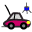 |
| 8 | `/)` | 09 | Wheelchair (handicapped) |  |
| 9 | `/*` | 10 | Snowmobile | 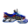 |
| 10 | `/+` | 11 | Red Cross | 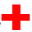 |
| 11 | `/,` | 12 | Boy Scouts |  |
| 12 | `/-` | 13 | House QTH (VHF) |  |
| 13 | `/.` | 14 | X |  |
| 14 | `//` | 15 | Red Dot |  |
| 15 | `/0` | 16 | 0 Circle |  |
| 16 | `/1` | 17 | 1 Circle |  |
| 17 | `/2` | 18 | 2 Circle |  |
| 18 | `/3` | 19 | 3 Circle |  |
| 19 | `/4` | 20 | 4 Circle |  |
| 20 | `/5` | 21 | 5 Circle |  |
| 21 | `/6` | 22 | 6 Circle |  |
| 22 | `/7` | 23 | 7 Circle |  |
| 23 | `/8` | 24 | 8 Circle |  |
| 24 | `/9` | 25 | 9 Circle |  |
| 25 | `/:` | 26 | Fire | 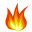 |
| 26 | `/;` | 27 | Campground (Portable ops) |  |
| 27 | `/<` | 28 | Motorcycle | 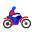 |
| 28 | `/=` | 29 | Railroad Engine |  |
| 29 | `/>` | 30 | Car | 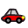 |
| 30 | `/?` | 31 | File Server |  |
| 31 | `/@` | 32 | Hurricane Future Prediction |  |
| 32 | `/A` | 33 | Aid Station |  |
| 33 | `/B` | 34 | BBS or PBBS |  |
| 34 | `/C` | 35 | Canoe |  |
| 35 | `/D` | 36 |  |  |
| 36 | `/E` | 37 | Eyeball (events, etc.) |  |
| 37 | `/F` | 38 | Farm Vehicle (Tractor) | 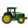 |
| 38 | `/G` | 39 | Grid Square (6-character) |  |
| 39 | `/H` | 40 | Hotel (blue bed icon) |  |
| 40 | `/I` | 41 | TCP/IP on air network station |  |
| 41 | `/J` | 42 |  |  |
| 42 | `/K` | 43 | School |  |
| 43 | `/L` | 44 | PC user |  |
| 44 | `/M` | 45 | MacAPRS |  |
| 45 | `/N` | 46 | NTS Station |  |
| 46 | `/O` | 47 | Balloon |  |
| 47 | `/P` | 48 | Police | 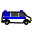 |
| 48 | `/Q` | 49 | TBD |  |
| 49 | `/R` | 50 | Recreational Vehicle | 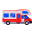 |
| 50 | `/S` | 51 | Space Shuttle |  |
| 51 | `/T` | 52 | SSTV |  |
| 52 | `/U` | 53 | Bus |  |
| 53 | `/V` | 54 | Amateur TV |  |
| 54 | `/W` | 55 | National Weather Service Site |  |
| 55 | `/X` | 56 | Helicopter | 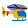 |
| 56 | `/Y` | 57 | Yacht (sail boat) |  |
| 57 | `/Z` | 58 | WinAPRS |  |
| 58 | `/[` | 59 | Jogger, Human/person | 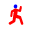 |
| 59 | `/\` | 60 | Triangle (DF) | 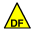 |
| 60 | `/]` | 61 | Mail/Post Office |  |
| 61 | `/^` | 62 | Large Aircraft |  |
| 62 | `/_` | 63 | Weather Station (blue) |  |
| 63 | `/‘` | 64 | Dish Antenna |  |
| 64 | `/a` | 65 | Ambulance | 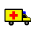 |
| 65 | `/b` | 66 | Bicycle | 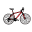 |
| 66 | `/c` | 67 | Incident Command Post |  |
| 67 | `/d` | 68 | Fire Department |  |
| 68 | `/e` | 69 | Horse (equestrian) | 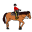 |
| 69 | `/f` | 70 | Fire Truck | 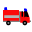 |
| 70 | `/g` | 71 | Glider |  |
| 71 | `/h` | 72 | Hospital |  |
| 72 | `/i` | 73 | IOTA (Islands on the Air) |  |
| 73 | `/j` | 74 | Jeep | 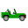 |
| 74 | `/k` | 75 | Truck | 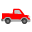 |
| 75 | `/l` | 76 | Laptop |  |
| 76 | `/m` | 77 | Mic-E Repeater |  |
| 77 | `/n` | 78 | Node (black bulls-eye) |  |
| 78 | `/o` | 79 | Emergency Operations Center | 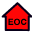 |
| 79 | `/p` | 80 | Rover (puppy dog) | 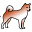 |
| 80 | `/q` | 81 | Grid Square shown above 128m | 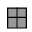 |
| 81 | `/r` | 82 | Repeater | 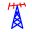 |
| 82 | `/s` | 83 | Ship (power boat) | 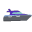 |
| 83 | `/t` | 84 | Truck Stop |  |
| 84 | `/u` | 85 | Truck (18-wheeler) | 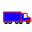 |
| 85 | `/v` | 86 | Van | 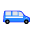 |
| 86 | `/w` | 87 | Water Station | 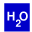 |
| 87 | `/x` | 88 | X-APRS (Unix) |  |
| 88 | `/y` | 89 | Yagi at QTH |  |
| 89 | `/z` | 90 | TBD |  |
| 90 | `/{` | 91 |  |  |
| 91 | `/|` | 92 |  |  |
| 92 | `/}` | 93 |  |  |
| 93 | `/~` | 94 |  |  |

## Alternate Symbol Table

| № (0-based) | Символ | GPS Cnn | Описание | Иконка |
|---|---|---|---|---|
| 0 | `\!` | 01 | Emergency |  |
| 1 | `\"` | 02 |  |  |
| 2 | `\ #` | 03 | Digi (green star) |  |
| 3 | `\$` | 04 | Bank or ATM (green box) |  |
| 4 | `\%` | 05 | Power Plant |  |
| 5 | `\ &` | 06 | I=IGate R=RX T=1hopTX 2=2hopTX |  |
| 6 | `\’` | 07 | Crash (& incident sites) | 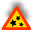 |
| 7 | `\(` | 08 | Cloudy |  |
| 8 | `\)` | 09 | Firenet MEO, MODIS Earth Obs. |  |
| 9 | `\*` | 10 | Snow |  |
| 10 | `\+` | 11 | Church |  |
| 11 | `\,` | 12 | Girl Scouts |  |
| 12 | `\-` | 13 | House (H=HF) (O = Op Present) |  |
| 13 | `\.` | 14 | Ambiguous (Big Question Mark) |  |
| 14 | `\/` | 15 | Waypoint Destination (Note 1) |  |
| 15 | `\ 0` | 16 | Circle (E/I/W= IRLP/EchoLink/WIRES) |  |
| 16 | `\1` | 17 |  |  |
| 17 | `\2` | 18 |  |  |
| 18 | `\3` | 19 |  |  |
| 19 | `\4` | 20 |  |  |
| 20 | `\5` | 21 |  |  |
| 21 | `\6` | 22 |  |  |
| 22 | `\7` | 23 |  |  |
| 23 | `\8` | 24 | 802.11 or other network node |  |
| 24 | `\9` | 25 | Gas Station (blue pump) | 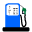 |
| 25 | `\:` | 26 | Hail |  |
| 26 | `\;` | 27 | Park/Picnic Area |  |
| 27 | `\<` | 28 | Advisory (one WX flag) |  |
| 28 | `\=` | 29 | APRStt Touchtone (DTMF Users) |  |
| 29 | `\ >` | 30 | Cars & Vehicles |  |
| 30 | `\?` | 31 | Information Kiosk (blue box with ?) |  |
| 31 | `\@` | 32 | Hurricane/Tropical Storm |  |
| 32 | `\ A` | 33 | Box: DTMF, RFID, XO |  |
| 33 | `\B` | 34 | Blowing Snow | 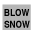 |
| 34 | `\C` | 35 | Coast Guard |  |
| 35 | `\D` | 36 | Drizzle | 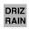 |
| 36 | `\E` | 37 | Smoke (& other vis codes) | 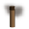 |
| 37 | `\F` | 38 | Freezing Rain | 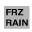 |
| 38 | `\G` | 39 | Snow Shower |  |
| 39 | `\H` | 40 | Haze | 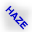 |
| 40 | `\I` | 41 | Rain Shower |  |
| 41 | `\J` | 42 | Lightning | 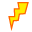 |
| 42 | `\K` | 43 | Kenwood HT (w) |  |
| 43 | `\L` | 44 | Lighthouse |  |
| 44 | `\M` | 45 | MARS (A=Army, N=Navy, F=AF) |  |
| 45 | `\N` | 46 | Navigation Buoy |  |
| 46 | `\O` | 47 | Rocket |  |
| 47 | `\P` | 48 | Parking | 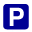 |
| 48 | `\Q` | 49 | Earthquake |  |
| 49 | `\R` | 50 | Restaurant |  |
| 50 | `\S` | 51 | Satellite | 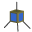 |
| 51 | `\T` | 52 | Thunderstorm | 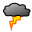 |
| 52 | `\U` | 53 | Sunny |  |
| 53 | `\V` | 54 | VORTAC Nav Aid |  |
| 54 | `\ W` | 55 | NWS Site |  |
| 55 | `\X` | 56 | Pharmacy Rx |  |
| 56 | `\Y` | 57 | Radios and devices |  |
| 57 | `\Z` | 58 |  |  |
| 58 | `\[` | 59 | Wall Cloud |  |
| 59 | `\\` | 60 |  |  |
| 60 | `\]` | 61 |  |  |
| 61 | `\ ^` | 62 | Aircraft (Shows Heading) |  |
| 62 | `\ _` | 63 | WX Station with Digi (green) |  |
| 63 | `\‘` | 64 | Rain |  |
| 64 | `\ a` | 65 | ARRL, ARES, WinLINK, Dstar, LoRa, etc |  |
| 65 | `\b` | 66 | Blowing Dust/Sand |  |
| 66 | `\ c` | 67 | CD triangle RACES/SATERN/etc | 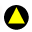 |
| 67 | `\d` | 68 | DX Spot (from callsign prefix) | 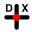 |
| 68 | `\e` | 69 | Sleet | 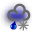 |
| 69 | `\f` | 70 | Funnel Cloud | 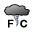 |
| 70 | `\g` | 71 | Gale Flags |  |
| 71 | `\h` | 72 | Store or Hamfest |  |
| 72 | `\ i` | 73 | BOX or points of Interest |  |
| 73 | `\j` | 74 | Work Zone (steam shovel) |  |
| 74 | `\k` | 75 | Special Vehicle SUV, ATV, 4x4 | 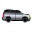 |
| 75 | `\l` | 76 | Area Symbols (box, circle, etc) |  |
| 76 | `\m` | 77 | Value Sign (3 digit display) | 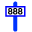 |
| 77 | `\ n` | 78 | Triangle | 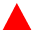 |
| 78 | `\o` | 79 | Small Circle |  |
| 79 | `\p` | 80 | Partly Cloudy | 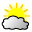 |
| 80 | `\q` | 81 |  |  |
| 81 | `\r` | 82 | Restrooms |  |
| 82 | `\ s` | 83 | Ship/Boat (top view) |  |
| 83 | `\t` | 84 | Tornado | 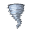 |
| 84 | `\ u` | 85 | Truck |  |
| 85 | `\ v` | 86 | Van | 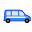 |
| 86 | `\w` | 87 | Flooding (Avalanches/Slides) | 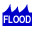 |
| 87 | `\x` | 88 | Wreck or Obstruction |  |
| 88 | `\y` | 89 | Skywarn | 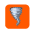 |
| 89 | `\z` | 90 | Overlayed Shelter |  |
| 90 | `\{` | 91 | Fog |  |
| 91 | `\|` | 92 |  |  |
| 92 | `\}` | 93 |  |  |
| 93 | `\~` | 94 |  |  |
