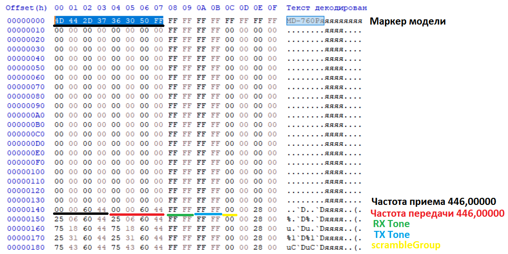

# Файл данных `.td` — подробная спецификация формата

Ниже полное описание формата `.td` (кодплаг) TIDRadio **TD-CPS Programming Software** по дизассемблированному коду. Документ описывает все смещения, типы данных, размеры и форматы кодирования.

---

## 1. Природа файла

`.td` — **сырой дамп EEPROM-образа рации**, размер **65 536 байт (0x10000)** без сжатия и шифрования.

- Исходник размера: `Settings.EEROM_SPACE = 65536u` (`Settings.cs:2053`).
- Пустой/неиспользованный байт = `0xFF`.
- Чтение/запись — `File.ReadAllBytes` / `File.WriteAllBytes` (`MainForm.cs:1930,1979,1995`).
- Формируется `MainForm.DataToByte()` (`MainForm.cs:2388`): заполняет `0xFF`, затем вплетает блоки в порядке: `Channels → GeneralSet → A/B → FM → DTMF → GNSS/APRS`.
- Разбор образа — `MainForm.ByteToData()` (`MainForm.cs:2410`), читает те же блоки.

### Какие блоки вплетаются (`DataToByte`, `MainForm.cs:2388-2408`)

| Порядок | Вызов | Блок |
|---|---|---|
| 1 | `ChannelForm.data.ToEerom(0)` → `CPS_CHANNEL_START` | Каналы + имена + индексы |
| 2 | `GeneralSetForm.ToEerom(array)` | Общие настройки |
| 3 | `A_B_ChannelForm.ToEerom(array)` | VFO A/B + сдвиг |
| 4 | `FMForm.ToEerom(array)` | FM-каналы/настройки |
| 5 | `DTMFCodeForm.ToEerom(array)` | DTMF-коды |
| 6 | `Array.Copy(GnssAprsRawData, ..., 12292, ...)` | GNSS/APRS (если есть) |

---

## 2. Заголовок файла — маркер `.td` (байты 0–7)

Важно не смешивать две сущности: **маркер файла `.td`** и **идентификатор прошивки устройства**. Это разные 8-байтовые значения, хранящиеся в разных местах.

### 2.1 Маркер `.td` — один на все модели

При сохранении в байты 0–7 файла пишется **единственный глобальный** `Settings.CUR_MODEL` (`Settings.cs:146,2057`):

```
0x4D 0x44 0x2D 0x37 0x36 0x30 0x50 0xFF
 'M'  'D'  '-'  '7'  '6'  '0'  'P'
```

= ASCII **`"MD-760P"` + `0xFF`**.

- Этот маркер **одинаков** для всех моделей (H3/H4/H7/H8/H9/638) и всех режимов. Программа не различает по нему, какая модель сохранила файл.
- При открытии (`openCodeplugFile`, `MainForm.cs:1996-2009`) проверяется только одно из двух:
  - первые 8 байт **все `0xFF`** → файл считается пустым/дефолтным — открывается;
  - первые 8 байт **равны `CUR_MODEL`** (`"MD-760P\xFF"`) → открывается;
  - иначе → «Model does not match».
- Сверки файла с выбранной моделью в этом месте **нет** — проверяется только маркер.

### 2.2 Идентификатор прошивки устройства — НЕ в `.td`

Для справки: пер-модельные 8-байтные идентификаторы из `OpenGD77Form.GetSupportedVersions()` (`OpenGD77Form.cs:615-637`) — это `VersionIdentifier` **самой рации**, читаемый с железа через USB, а не заголовок файла. В `.td` они не фигурируют:

| Модель | DisplayName | Режим | VersionIdentifier (hex) | ASCII |
|---|---|---|---|---|
| H3Plus | H3 Plus | Normal | `503331313833FFFF` | `P31183`+FF FF |
| H3Plus | H3 Plus | GMRS | `503331313834FFFF` | `P31184`+FF FF |
| H3Plus | H3 Plus | Ham | `503331313835FFFF` | `P31185`+FF FF |
| H4 | H4 | Normal | `54444834FFFFFF4E` | `TDH4`+FF FF FF `N` |
| H4 | H4 | GMRS | `54444834FFFFFF47` | `TDH4`+FF FF FF `G` |
| H4 | H4 | Ham | `54444834FFFFFF48` | `TDH4`+FF FF FF `H` |
| H7Plus | H7 Plus | Normal | `54444837504C554E` | `TDH7PLUN` |
| H7Plus | H7 Plus | GMRS | `54444837504C5547` | `TDH7PLUG` |
| H7Plus | H7 Plus | Ham | `54444837504C5548` | `TDH7PLUH` |
| H8-4rd | H8-4rd | Normal | `544448383447454E` | `TDH84GEN` |
| H8-4rd | H8-4rd | GMRS | `5444483834474547` | `TDH84GEG` |
| H8-4rd | H8-4rd | Ham | `5444483834474548` | `TDH84GEH` |
| H9 | H9 | Normal | `54444839FFFFFF4E` | `TDH9`+FF FF FF `N` |
| H9 | H9 | GMRS | `54444839FFFFFF47` | `TDH9`+FF FF FF `G` |
| H9 | H9 | Ham | `54444839FFFFFF48` | `TDH9`+FF FF FF `H` |
| 638UV | 638UV | Normal | `544436333855564E` | `TD638UVN` |
| 638UV | 638UV | GMRS | `5444363338555647` | `TD638UVG` |
| 638UV | 638UV | Ham | `5444363338555648` | `TD638UVH` |

### 2.3 Возможности моделей (`Settings.cs:570-651`)

| Серия | GNSS | GNSS-StationType | APRS | MidPower | TopKey | KeyCode2=GNSS | Thai | PY32 | BLE-Only |
|---|---|---|---|---|---|---|---|---|---|
| H3Plus | – | – | – | – | – | – | – | – | – |
| H4 | + | + | + | – | + | + | + | + | – |
| H7Plus | + | – | – | + | – | – | – | – | – |
| H8 | – | – | – | + | + | – | – | – | + |
| H9 | + | + | + | + | + | + | + | + | – |
| 638UV | + | + | + | + | + | + | + | + | – |

---

## 3. Общая карта смещений в 64 КБ

Источник: `DMR/CpsAddrCfg.cs`.

| Смещ. dec | hex | Содержимое | Размер |
|---|---|---|---|
| 0 | 0x0000 | маркер модели `"MD-760P\xFF"` | 8 |
| 16 | 0x0010 | данные каналов (`CPS_CHANNEL_START`) | 3184 (199×16) |
| 3216 | 0x0C90 | общие настройки (keyConfig…bandConfig, `ADDR_GENERAL_SET`) | до 3272 |
| 3234 | 0x0CA2 | FM: workMode+monitor (бит 7 и бит 3) | 1 |
| 3238 | 0x0CA6 | FM: currentChannel | 1 |
| 3248 | 0x0CB0 | сдвиг частоты VFO A/B (`CPS_FREQ_OFFSET_START`) | 8 (4+4) |
| 3264 | 0x0CC0 | bandConfig (диапазоны частот) | 8 |
| 3280 | 0x0CD0 | FM-каналы (25×4) | 100 |
| 3392 | 0x0D40 | имена каналов | 1592 (199×8) |
| 6144 | 0x1800 | DTMF: stun/kill/localId/…/end (см. §7) | 224 |
| 6400 | 0x1900 | индекс каналов (валидность) | 25 |
| 6432 | 0x1920 | индекс сканирования | 25 |
| 6464 | 0x1940 | FM: битовая карта валидных каналов | 4 |
| 6480 | 0x1950 | VFO A | 16 |
| 6496 | 0x1960 | VFO B | 16 |
| 6512 | 0x1970 | FM VFO-частота | 4 |
| 6516 | 0x1974 | `CPS_FM_SETTINGS` — только декларирован, **не используется** | 2 |
| 7168 | 0x1C00 | bootMsg1 | 16 |
| 7184 | 0x1C10 | bootMsg2 | 16 |
| 7200 | 0x1C20 | bootMsg3 | 16 |
| 7968 | 0x1F20 | micGain | 1 |
| 7976 | 0x1F28 | languageSelect | 1 |
| 7977 | 0x1F29 | displayStyle | 1 |
| 7978 | 0x1F2A | menuColor | 1 |
| 7979 | 0x1F2B | vfoScanUpperLimit | 2 |
| 7981 | 0x1F2D | vfoScanLowerLimit | 2 |
| 7983 | 0x1F2F | scanHangTime | 1 |
| 12292 | 0x3004 | расширенные функции/регион (ext func) | 58 |
| 12390 | 0x3066 | GNSS-конфигурация | 21 |
| 12411 | 0x307B | GNSS-station type | 1 |
| 12412 | 0x307C | APRS-конфигурация | 152 |
| 12564 | 0x3114 | `CPS_FULL_BUFFER_SIZE` — конец реальных данных | |
| 32768 | 0x8000 | расширенные каналы (`CPS_EXT_CHANNEL_START…0xCB8D`) | |

Основная рабочая область: `CPS_START=16`, `CPS_END=7984`, `CPS_LEN=8000`.

---

## 4. Общие форматы кодирования (используются повторно)

     

### 4.1 Частота — packed BCD, 8 цифр, little-endian по парам

4 байта, 2 цифры на байт. Значение в **Гц** как 8-значное целое (`000.00000` МГц).

- Пример: `446.03125` МГц → `44603125` Hz → `{0x25, 0x31, 0x60, 0x44}`.
- Байт `[0]` = младшая пара цифр (последние 2 цифры Гц), `[3]` = старшая.
- Пусто/сброс: все байты `0xFF` (каналы, VFO) либо `0` (FM).
- Читается склейкой `[3][2][1][0]`, точка после 3-й цифры → `0.00000`.
- Функции: `ChannelForm.CaculateFreq_*`, `A_B_ChannelForm.EncodeFrequency`.

### 4.2 Субтон CTCSS/DCS — 2 байта

- **CTCSS**: 4 BCD-цифры кода в децигерцах (напр. `88.5` → `885` → `"0885"`). `byte[0]` = последние 2 цифры (`0x85`), `byte[1]` = первые 2 (`0x08`). OFF → `{FF FF}`.
- **DCS**: `byte[0]` = `(десятки<<4)|единицы` трехзначного октального кода; `byte[1]` = `(полярность<<4)|сотни`, полярность `8`=N `0xC`=I. Строка `D023N`/`D023I`.
- Определение типа: старшая тетрада `byte[1]` `<8` → CTCSS, `>=8` → DCS.
- Функции: `ChannelForm.CaculateSubaudio_*`, `A_B_ChannelForm.EncodeSubaudio`.

### 4.3 Сериализация структур

- `Settings.objectToByteArray(obj, chunkSize)` (`Settings.cs:1647`): `Marshal.StructureToPtr` → побайтовое копирование.
- `Settings.smethod_62(byte[], Type)` (`Settings.cs:1673`): `Marshal.PtrToStructure` (байты → структура).
- Имена строк: кодировка **GB2312** (`Settings.smethod_23/smethod_25`).

---

## 5. Блок каналов (смещения 16 / 0x10)

### 5.1 Данные канала `ChannelOne` — 16 байт × 199

Источник: `DMR/ChannelForm.cs:197-220`.

| +off | Поле | Тип | Размер |
|---|---|---|---|
| +0 | `rxFreq` | byte[4] (BCD, §4.1) | 4 |
| +4 | `txFreq` | byte[4] (BCD) | 4 |
| +8 | `rxTone` | byte[2] (субтон, §4.2) | 2 |
| +10 | `txTone` | byte[2] | 2 |
| +12 | `scrambleGroup` | byte (0–16) | 1 |
| +13 | `flags1` | byte (см. ниже) | 1 |
| +14 | `flags2` | byte | 1 |
| +15 | `reserved` | byte | 1 |

**`flags1`** (маска сохранения `&0xE4`): биты 7–6 `PttId` (0..3), бит 5 `FreqHop`, бит 2 `BusyLock`.
**`flags2`** (маска `&0x3B`): биты 5–4 `PowerLevel` (0=L,1=M,2=H), бит 3 `ChBand` (0=Wide,1=Narrow), биты 1–0 `FreqOffset` (0=off,1=-,2=+).
**`reserved`**: биты 1–0 = `RxModel` (0=FM, 1=AM).

Имена НЕ входят в этот блок (см. §5.2).

### 5.2 Имена каналов `ChannelNameOne` — 8 байт × 199 (смещение 3392 / 0x0D40)

`channelName: byte[8]` — GB2312, остаток после текста `0xFF`.

### 5.3 Индекс каналов (смещение 6400 / 0x1900) — 25 байт

Битовая карта «канал валиден», 199 каналов (биты 0..198). `chIndex` заполняется: канал валиден, если RX-частота парсится и `> 0`. Работа через `BitArray`.

### 5.4 Индекс сканирования (смещение 6432 / 0x1920) — 25 байт

Битовая карта «канал в списке сканирования», те же 199 бит.

### Как строится блок (см. `ChannelForm.ToEerom(0)`, массив 60000)

| Секция | Смещение внутр. | Абс. в EEPROM | Размер |
|---|---|---|---|
| каналы | 0 | 16 | 199×16=3184 |
| имена | 3376 | 3392 | 199×8=1592 |
| chIndex | 6384 | 6400 | 25 |
| scanIndex | 6416 | 6432 | 25 |

---

## 6. Блок общих настроек `GeneralSet` (адрес 3216 / 0x0C90)

Источник: `DMR/GeneralSetForm.cs:69-158`, `Settings.ADDR_GENERAL_SET=3216`, `Settings.SPACE_GENERAL_SET=Marshal.SizeOf(GeneralSet)=93` (логический; фактически поля разбросаны).

| Абс. смещ. | +off от 3216 | Поле | Тип/размер | Кодирование |
|---|---|---|---|---|
| 3216 | +0 | `keyConfig[0]` | byte | TopKeyShort (0, если нет TopKey) |
| 3217 | +1 | `keyConfig[1]` | byte | Side1KeyShort |
| 3218 | +2 | `keyConfig[2]` | byte | Side2KeyShort |
| 3219 | +3 | `keyConfig[3]` | byte | TopKeyLong |
| 3220 | +4 | `keyConfig[4]` | byte | Side1KeyLong |
| 3221 | +5 | `keyConfig[5]` | byte | Side2KeyLong |
| 3224 | +8 | `aniEnable` | byte | вкл/выкл DTMF-сигнализации |
| 3225 | +9 | `dtmfResetTime` | byte | 关闭/5S/10S/15S |
| 3226 | +10 | `autoAnswer` | byte | автоответ |
| 3227 | +11 | `dtmfSpeed` | byte | скорость DTMF 80..150ms |
| 3228 | +12 | `scanRange` | byte | диапазон сканирования |
| 3229 | +13 | `backlightLevel` | byte | 0..4 |
| 3232 | +16 | `optionConfig[16]` | byte[16] | битовые настройки, см. таблицу ниже |
| 3264 | +48 | `bandConfig[8]` | byte[8] | диапазоны частот, см. ниже |
| 7168 | [+3952] | `bootMsg1[16]` | byte[16] | загрузочное сообщение 1 |
| 7184 | [+3968] | `bootMsg2[16]` | byte[16] | 2 |
| 7200 | [+3984] | `bootMsg3[16]` | byte[16] | 3 |
| 7968 | [+4752] | `micGain` | byte | 0..32 |
| 7976 | [+4760] | `languageSelect` | byte | индекс языка |
| 7977 | [+4761] | `displayStyle` | byte | стиль дисплея |
| 7978 | [+4762] | `menuColor` | byte | цвет меню |
| 7979 | [+4763] | `vfoScanUpperLimit[2]` | byte[2] | 16-бит LE (1..999) |
| 7981 | [+4765] | `vfoScanLowerLimit[2]` | byte[2] | 16-бит LE |
| 7983 | [+4767] | `scanHangTime` | byte | индекс задержки |

### `optionConfig[16]` — побитовая расшифровка (смещение 3232)

| Байт | Биты | Назначение |
|---|---|---|
| `[0]` | 7 TxScreenOn, 6 RxScreenOn, 4=Ham mode, 3=GMRS mode, 2 DtmfSidetone, 1 PriorityTxBusy | экраны/режим/DTMF |
| `[1]` | бит 6-5? (GetBits shift6 mask3) ScanMode, бит 4 KeyAutoLock, бит 2 KeyBeep, бит 0 VoiceAnnounce | cкан/звук |
| `[2]` | 7 RadioVfoMode, бит 4 (mask3) ToneFreq, бит 3 RadioMonitor, бит 2 ADisplayOn, биты 0-1 AChannelMode | режимы A |
| `[3]` | бит 6 (mask3) BootDisplay, бит 4 BDisplayOn, бит 2 DualWatch, биты 0-1 BChannelMode | режимы B |
| `[4]` | все 8 | `AChannelNum` (номер канала A) |
| `[5]` | все 8 | `BChannelNum` |
| `[6]` | — | не используется |
| `[7]` | 6 TailEliminate, биты 0-2 VoxLevel, а также биты (для опций DTMF) 4 RemouteKill, 3 RemoteStun — совмещены | tail/вокс |
| `[8]` | старшая тетрада AStep, младшая BStep | шаг сетки A/B |
| `[9]` | все 8 | уровень шумоподавления (0..9) |
| `[10]` | все 8 | TOT (индекс) |
| `[11]` | биты 6-5 TxEndTone, биты 4/3/2 Tx200En/Tx350En/Tx500En | тоны/огр. передачи |
| `[12]` | все 8 | PowerSave (индекс) |
| `[13]` | все 8 | AutoBacklight (индекс) |
| `[14]` | биты 0-3 VoxDelay | задержка VOX |
| `[15]` | 7 SingleChannelMode, биты 0-1 AlarmMode, биты 4-6 BreathLed | доп. режимы |

> Примечание: точные маски — `BitHelper.SetBits (маска 3/7/15)`. Некоторые флаги кодируются через `IsHamMode/IsGMRSMode` автоматически.

### `bandConfig[8]` (смещение 3264)

Два диапазона «низ-верх» по 2 значения, каждое BCD 3 цифры в 2 байта (`EncodeFreqToBCD`):
- `[0..1]` = нижняя граница диапазона 1 (MHz)
- `[2..3]` = верхняя граница диапазона 1
- `[4..5]` = нижняя граница диапазона 2
- `[6..7]` = верхняя граница диапазона 2

Формат значения: `bytes[off]=(сотни<<4)|десятки`, `bytes[off+1]=(единицы<<4)|0`. Дефолт `"108-174"` / `"200-600"`.

### bootMsg (7168/7184/7200)

До 16 печатных ASCII (от `' '` до `'~'`), GB2312, остаток нулями.

---

## 7. Блок DTMF (смещение 6144 / 0x1800)

Источник: `DMR/DTMFCodeForm.cs:18-136`. Каждый байт = одна DTMF-цифра (0–9,A,B,C,D,\*,#) со значениями 0–15.

| Смещ. | Поле | Длина | Диапазон |
|---|---|---|---|
| 6144 | `stunCode` | 16 | 6144–6159 |
| 6160 | `killCode` | 16 | 6160–6175 |
| 6176 | `localId` | 3 | 6176–6178 |
| 6185 | `groupCode` | 1 | 6185 |
| 6192 | `codeGroup1` | 16 | 6192–6207 |
| 6208 | `codeGroup2` | 16 | 6208–6223 |
| 6224 | `codeGroup3` | 16 | 6224–6239 |
| 6240 | `codeGroup4` | 16 | 6240–6255 |
| 6256 | `codeGroup5` | 16 | 6256–6271 |
| 6272 | `codeGroup6` | 16 | 6272–6287 |
| 6288 | `codeGroup7` | 16 | 6288–6303 |
| 6304 | `codeGroup8` | 16 | 6304–6319 |
| 6336 | `startCode` | 16 | 6336–6351 |
| 6352 | `endCode` | 16 | 6352–6367 |

- **STUN/KILL/START/END**: байт `[15]` = длина строки; коды цифр с `[0]`.
- **localId / codeGroup1..8**: простой массив цифр с `[0]`, остаток `0xFF`.
- Неиспользуемые «дыры»: 6179–6184, 6186–6191, 6320–6335.
- `optionConfig[7]` в GeneralSet несёт флаги `RemoteStun` (бит 3 = 0x08) и `RemoteKill` (бит 4 = 0x10).

---

## 8. Блок VFO A/B (смещения 6480 и 6496)

Источник: `DMR/A_B_ChannelForm.cs:71-122`. Структура `VfoData` 16 байт.

| +off | Поле | Тип/размер | Комментарий |
|---|---|---|---|
| +0 | `rxFreq` | byte[4] | BCD §4.1 |
| +4 | `txFreq` | byte[4] | BCD §4.1 |
| +8 | `rxCtcDcs` | byte[2] | субаудио §4.2 |
| +10 | `txCtcDcs` | byte[2] | субаудио §4.2 |
| +12 | `scrambler` | byte | |
| +13 | `byte13` | byte | биты 7–6 PttId, бит 5 HopFreq, бит 2 BusyLock |
| +14 | `byte14` | byte | бит 6 ScramblerEn, биты 5–4 Power, бит 3 NarrowBand, биты 1–0 OffsetDir |
| +15 | `byte15` | byte | биты 1–0 RxModel |

Дефолт: частоты `{FF×4}`, тоны `{FF FF}`, `byte14=0x20`, остальное 0.

### Сдвиг частоты (смещение 3248 / 0x0CB0)

- `[0..3]` = сдвиг VFO A, `[4..7]` = сдвиг VFO B.
- BCD 6-значное число (положение `0.00000`), little-endian по парам, 4 байта.
- Пустой/сброс = 4 нулевых байта.

---

## 9. Блок FM (смещения 3234, 3238, 3280, 6464, 6512)

Источник: `DMR/FMForm.cs:526-595`.

| Смещ. | Содержимое | Размер | Примечание |
|---|---|---|---|
| 3234 | workMode + monitorEnable упакованы: бит 7 = workMode (0=VFO,1=信道), бит 3 = monitorEnable | 1 | |
| 3238 | currentChannel (1..25) | 1 | |
| 3280 | `radioChannels[100]` — 25 каналов × 4 байта | 100 | частота, BCD, значимы 2 байта |
| 6464 | `validChannels[4]` — битовая карта 25 каналов | 4 | бит `n` (1..25) → байт `(n-1)/8`, бит `(n-1)%8` |
| 6512 | `vfoFreq[4]` — FM VFO-частота | 4 | BCD, значимы 2 байта |
| 6516 | `CPS_FM_SETTINGS` (декларирован) | 2 | **не используется FMForm** |

**Частота FM-канала (4 байта, значимы 2):**
- `num = round(freq_MHz × 10)` (0.1 МГц шаг, диапазон 76–108).
- `buffer[0]` = `(десятки<<4)|единицы`, `buffer[1]` = `(сотни<<4)|тысячи` (`EncodeFrequency`).
- Пример: `107.5` → `1075` → `buffer[0]=0x75, buffer[1]=0x10, buffer[2]=0, buffer[3]=0`.
- Декодирование: `(b1>>4)*1000 + (b1&F)*100 + (b0>>4)*10 + (b0&F)`, делим на 10. Вне 76–108 → 76.0.

---

## 10. GNSS/APRS-область (смещения 12292 / 0x3004 и далее)

### 10.1 Природа блока: «сквозной» (pass-through)

Ключевая особенность: **этот CPS НЕ расшифровывает и НЕ редактирует поля GNSS/APRS по отдельности.** В дизассемблированном коде нет ни структуры, ни формы для их построения. Область `12292..12564` копируется целиком, как непрозрачный байтовый буфер:

- `GnssAprsRawData` (`MainForm.cs:25`) — сырой `byte[]`.
- **Запись:** `ByteToData` при чтении образа из файла/рации:
  ```csharp
  if (Settings.HasGNSS() && eerom.Length >= 12411) {
      int num = 12292;
      int num2 = (Settings.HasAPRS() ? 12564 : 12411);
      GnssAprsRawData = new byte[num2 - num];
      Array.Copy(eerom, num, GnssAprsRawData, 0, num2 - num);
  }
  ```
  (`MainForm.cs:2471-2484`)
- **Чтение:** `DataToByte` при сохранении образа:
  ```csharp
  if (Settings.HasGNSS() && GnssAprsRawData != null) {
      Array.Copy(GnssAprsRawData, 0, array, 12292, GnssAprsRawData.Length);
  }
  ```
  (`MainForm.cs:2399-2406`)
- Удаление/сброс — `GnssAprsRawData = null` (`MainForm.cs:2869`).
- При работе с рацией весь этот регион читается/пишется отдельным обращением `ReadDataNewProtocol`/`WriteDataNewProtocol` (диапазон до 12564 или 12411), значение по умолчанию — `0xFF` (`OpenGD77Form.cs:1932-1957, 2008-2020`).

**Следствие:** внутренняя побайтовая раскладка настроек GNSS/APRS в `MainForm.cs` не определена — эти байты берутся «как есть» с устройства (формат унаследован у OpenGD77/GD77 кодплага) и сохраняются в `.td` без изменения.

### 10.2 Известная карта региона (из `DMR/CpsAddrCfg.cs:181-211`)

| Смещ. | hex | Поле | Длина | Замечание |
|---|---|---|---|---|
| 12292 | 0x3004 | `CPS_EXT_FUNC` / `CPS_EXT_REGION_START` | 58 | расширенные функции/начало «extended region» |
| 12390 | 0x3066 | `CPS_GNSS_CONFIG_START` | 21 | конфигурация GNSS |
| 12411 | 0x307B | `CPS_GNSS_STATION_TYPE_START` | 1 | тип GNSS-станции |
| 12412 | 0x307C | `CPS_APRS_CONFIG_START` | 152 | конфигурация APRS |
| 12564 | 0x3114 | `CPS_APRS_CONFIG_END` = `CPS_EXT_REGION_END` | — | конец реальных данных (`CPS_FULL_BUFFER_SIZE`) |

Также объявлен псевдоним: `CPS_GNSS_REGION_START = 12390`, `CPS_GNSS_REGION_END = 12564` (от GNSS-конфига до конца APRS, 174 байта).

### 10.3 Динамическая длина региона (по модели)

Фактический размер копируемого блока зависит от возможностей выбранной модели (`Settings.HasGNSS()` / `HasAPRS()` / `HasGNSSStationType()`):

| Условие | Начало | Конец (= конец блока) | Размер |
|---|---|---|---|
| `HasGNSS()` + `HasAPRS()` | 12292 | **12564** | 272 |
| `HasGNSS()` без APRS | 12292 | **12411** | 119 |
| `HasGNSS()` + `HasGNSSStationType()` (H4/H9/638) | 12292 | 12411 (стоп по 12411) | 119 |
| `HasGNSS()` без station-type (H7Plus) | 12292 | 12411 | 119 |
| нет `HasGNSS()` (H3, H8) | — | — | блок **не пишется** в `.td`, остаётся `0xFF` |

- `HasGNSS()` = H4, H7Plus, H9, 638UV (все режимы). H3, H8 — нет.
- `HasAPRS()` = H4, H9, 638UV.
- `HasGNSSStationType()` = H4, H9, 638UV (у H7Plus APRS/station-type нет, поэтому хвост режется по 12411).

Формула в коде (`MainForm.cs:2476`, `OpenGD77Form.cs:1935,2011`):
```
num2 = HasGNSS() ? (HasAPRS()   ? 12564     // APRS-модели
                   : 12411)      // GNSS-без-APRS
       : —                       // блока нет
При отсутствии HasGNSSStationType() -> num2 принудительно = 12411
```

### 10.4 Где настройки GNSS/APRS могли бы жить

- В интерфейсе упоминание GNSS ограничено пометкой клавиши `KeyCode2IsGNSS()` = меню «GNSS» для H4/H9/638 (`GeneralSetForm.cs:1762-1764`). Сама форма редактирования GNSS/APRS-полей в этом билде отсутствует.
- Настройки GNSS/APRS **не сериализуются** никакой из структур (§§5–9). В `.td` они присутствуют только как копия данных, прочитанных с рации.

> **Замечание о полноте документации:** поскольку внутренние поля GNSS (12390, 21 байт) и APRS (12412, 152 байта) в дизассемблированном коде нигде не разбираются, их точную побайтовую семантику (например, поля callsign/beacon/интервалов отправки) по этому проекту восстановить нельзя — код хранит их байт-в-байт. Для поимённого описания этих полей нужны привязки формата OpenGD77 (исходники прошивки GD77), а не этот CPS.

---

## 11. Связанные константы моделей (`Settings.cs`)

- `SUPER_PWD = "DT8168"` (140).
- `CUR_MODE = 2` (2097), `CUR_CH_GROUP = 0`, `CUR_ZONE_GROUP = 0`, `CUR_ZONE = 0`.
- Частотные границы (Normal/Ham): RX 108–174 и 200–600 МГц; Ham TX 144–148 и 420–450 МГц; H4 — 6 диапазонов по `H4_MIN/MAX_FREQ`.
- `MIN_FREQ={200,108}`, `MAX_FREQ={600,174}`, `MIN_FREQ_FM={76}`, `MAX_FREQ_FM={108}`, `FREQ_STEP_1=250`, `FREQ_STEP_2=625`.
- `GMRS_STANDARD_FREQS` — 30 значение 462.5625–467.7250 МГц.

---

## 12. Важные замечания

1. **Поле `name` (string) канала не входит в 16 байт** — имена вынесены в отдельный блок имени.
2. **`ToEerom` каналов игнорирует `chGroupIndex`** — кладёт одну группу с начала; расстановка по группам — на уровне `MainForm` по `CPS_*` адресам.
3. **Расхождения в коде:** `CPS_FM_SETTINGS_START=6516` заявлен, но фактически используется 3234/3238. `.g77`/`.dat` открываются тем же кодом, что и `.td` (raw EEPROM).
4. `.td` сохраняется размером 65536 байт; при чтении короткого буфера `ByteToData` копирует только доступные границы (защита по длине).

---

## 13. Примеры декодирования

1. [**td->csv**](td_to_csv.py) - извлечение каналов из .td файла в CSV (Python)

---

## 14. Пример кодирования

1. [**csv->td**](csv_to_td.py) - изменение каналов в .td файле из CSV (Python)

## 15. Пример реализации

1. [**TDRadioCodeplug**](TDRadioCodeplug.cs) - класс для работы с .td файлом.
2. [**TidRadioTool**](TDRadioTool/bin) - консольная утилита
3. [**TD-Editor**](tr-editor.html) - html-редактор каналов
