# TIDRADIO TD-H9 — Руководство пользователя

Перевод официального руководства пользователя ([Ham Version, 71 стр.](H9_Ham_Version_User_Manual.pdf)), измененное и дополненное.

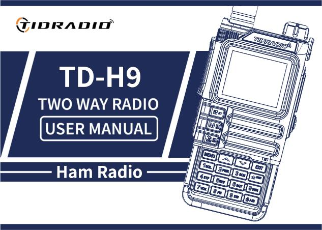

## Содержание
* [Предисловие](#предисловие)
    * [1.1 Информация по безопасности для любительских раций](#11-информация-по-безопасности-для-любительских-раций)
    * [1.2 Основные возможности](#12-основные-возможности)
    * [1.3 Обслуживание (кратко)](#13-обслуживание-кратко)
* [2. Аккумуляторная батарея](#2-аккумуляторная-батарея)
    * [2.1 Зарядка](#21-зарядка)
    * [2.2–2.3 Зарядное устройство и меры предосторожности](#2223-зарядное-устройство-и-меры-предосторожности)
    * [2.4 Как заряжать](#24-как-заряжать)
    * [2.5 Светодиодный индикатор ЗУ](#25-светодиодный-индикатор-зу)
    * [2.6 Хранение аккумулятора](#26-хранение-аккумулятора)
    * [2.7 Зарядка через USB-C](#27-зарядка-через-usb-c)
* [3. Установка аксессуаров](#3-установка-аксессуаров)
* [4. Обзор радиостанции](#4-обзор-радиостанции)
    * [4.1 Кнопки и органы управления](#41-кнопки-и-органы-управления)
    * [4.2 ЖК-дисплей. Значки](#42-жк-дисплей-значки)
    * [4.3 Светодиодные индикаторы](#43-светодиодные-индикаторы)
    * [4.4 Основные клавиши управления](#44-основные-клавиши-управления)
    * [4.5 Дополнительные комбинации клавиш и включения](#45-дополнительные-комбинации-клавиш-и-включения)
    * [4.6 Цифровая клавиатура](#46-цифровая-клавиатура)
* [5. Базовые операции](#5-базовые-операции)
    * [5.1 Включение](#51-включение)
    * [5.2 Громкость](#52-громкость)
    * [5.3 Выбор канала](#53-выбор-канала)
    * [5.4 Вызов](#54-вызов)
    * [5.5 Частотный режим (VFO)](#55-частотный-режим-vfo)
    * [5.6 Канальный режим (MR)](#56-канальный-режим-mr)
* [6. Дополнительные функции](#6-дополнительные-функции)
    * [6.1 Сканирование частот](#61-сканирование-частот)
    * [6.2 Сканирование каналов](#62-сканирование-каналов)
    * [6.3 Сканирование CTCSS/DCS](#63-сканирование-ctcssdcs)
    * [6.4 Программирование каналов вручную](#64-программирование-каналов-вручную)
    * [6.5 Аварийный сигнал (Emergency Alert)](#65-аварийный-сигнал-emergency-alert)
    * [6.6 FM-радио](#66-fm-радио)
    * [6.7 NOAA-погода](#67-noaa-погода)
    * [6.8 Тон репитера (1000 / 1450 / 1750 / 2100 Гц)](#68-тон-репитера-1000--1450--1750--2100-гц)
    * [6.9 Функция вызова (Bluetooth-звонки)](#69-функция-вызова-bluetooth-звонки)
    * [6.10 Функция «Аудио» (музыка через рацию)](#610-функция-аудио-музыка-через-рацию)
    * [6.11 OD PTT (Odmaster PTT)](#611-od-ptt-odmaster-ptt)
    * [6.12 Программирование по Bluetooth](#612-программирование-по-bluetooth)
* [7. Работа с меню](#7-работа-с-меню)
    * [7.1 Основное использование](#71-основное-использование)
    * [7.2 Короткие команды (шорткаты)](#72-короткие-команды-шорткаты)
    * [7.31 Radio Setting (Настройки радио)](#731-radio-setting-настройки-радио)
    * [7.32 Program Channel (Программирование канала)](#732-program-channel-программирование-канала)
    * [7.33 Analog Set](#733-analog-set)
    * [7.34 Radio Information](#734-radio-information)
    * [7.35 Scan (Сканирование)](#735-scan-сканирование)
    * [7.36 Bluetooth](#736-bluetooth)
    * [7.37 Обновление прошивки](#737-обновление-прошивки)
    * [7.38 GNSS (GPS)](#738-gnss-gps)
    * [7.39 Site Type (Тип позиции)](#739-site-type-тип-позиции)
    * [7.40 APRS](#740-aprs)
    * [7.41 Подробное описание функций APRS](#741-подробное-описание-функций-aprs)
    * [7.42 Удаленное управление репитером APRS](#742-удаленное-управление-репитером-aprs)
    * [7.43 Ретрансляция APRS-пакетов дигипитером](#743-ретрансляция-aprs-пакетов-дигипитером)
    * [7.44 APRS Worldwide Частоты](#744-aprs-worldwide-частоты)
    * [7.45 Схожая по функционалу APRS-радиостанция](745-схожая-по-функционалу-aprs-радиостанция)
* [Приложение A. Поиск и устранение неисправностей](#приложение-a-поиск-и-устранение-неисправностей)
* [Приложение B. Технические характеристики](#приложение-b-технические-характеристики)
* [Приложение C. Таблица DCS-кодов](#приложение-c-таблица-dcs-кодов)
* [Приложение D. Таблица CTCSS-тонов](#приложение-d-таблица-ctcss-тонов)
* [Приложение E. Программное обеспечение](#приложение-E-программное-обеспечение)
* [Приложение F. Каналы и пресеты](#приложение-F-каналы-и-пресеты)

---

## Предисловие

Благодарим за покупку рации TD-H9. Это многофункциональная любительская (ham) радиостанция, сочетающая новейшие технологии радиосвязи с прочной механической конструкцией. TD-H9 — идеальное и эффективное решение для профессионалов, которым необходимо поддерживать связь с рабочей командой (стройплощадки, здания, выставки, отели и т. п.), а также для пользователей, которым связь нужна для отдыха и семьи.

**Важное уведомление.** Чтобы защитить себя от травм и порчи имущества, которые могут возникнуть при неправильной эксплуатации, внимательно прочитайте руководство перед использованием. Оно содержит инструкции по безопасному использованию, а также информацию об осознанности и контроле воздействия радиочастотной энергии.

### 1.1 Информация по безопасности для любительских раций

Ваша портативная радиостанция содержит маломощный передатчик. При нажатии тангенты (кнопки разговора) он излучает радиочастотные сигналы. Устройство рассчитано на работу с коэффициентом заполнения не более 50 %. В августе 1996 года FCC приняла рекомендации по воздействию радиочастотного излучения с уровнями безопасности для портативных беспроводных устройств.

**Предупреждение FCC (Part 15.21).** Изготовитель не несёт ответственности за любые изменения или модификации, явно не одобренные стороной, ответственной за соответствие. Такие изменения могут аннулировать право пользователя на эксплуатацию данного оборудования.

**Соответствие требованиям FCC (Part 15).** Данное оборудование проверено и признано соответствующим ограничениям для цифровых устройств класса B согласно части 15 правил FCC. Эти ограничения призваны обеспечить разумную защиту от вредных помех в жилых помещениях. Оборудование генерирует и может излучать радиочастотную энергию. Нет гарантии, что помехи не возникнут в конкретной установке. Проверка помех производится выключением и включением устройства (см. перечень мер: изменить ориентацию/место антенны, увеличить расстояние между устройствами, подключить устройство в другую розетку, обратиться к продавцу или специалисту).

**ПРЕДУПРЕЖДЕНИЕ!** Модификация устройства для приёма сигналов сотовых радиотелефонов ЗАПРЕЩЕНА правилами FCC и федеральным законом.

**Соответствие ЕС.** Продукт соответствует требованиям директивы 2014/53/EU. ВНИМАНИЕ: европейские пользователи должны иметь действующую любительскую лицензию для передачи на частотах и уровнях мощности данного устройства. Несоблюдение может быть незаконным и повлечь преследование.

**Соответствие стандартам РЧ-воздействия.** Устройство соответствует: FCC 47 CFR § 1.1307, 1.1310 и 2.1093; ANSI/IEEE C95.1:2005; Canada RSS102 Issue 5 (март 2015); IEEE C95.1:2005 Edition.

**Информация о РЧ-воздействии.** Не позволяйте детям пользоваться рацией без присмотра взрослых. Используйте только комплектную или одобренную антенну; повреждённая антенна при контакте с кожей может вызвать небольшой ожог. При работе голова к лицу держите рацию на расстоянии 1 дюйма (2,5 см) от лица. Для ношения на теле используйте комплектный поясной зажим.

### 1.2 Основные возможности

- Выходная мощность: до 10 Вт (три уровня: высокая, средняя, низкая).
- Диапазоны (TX/RX): 136–174 (VHF), 174–245 (SatCom), 240–260, 290–350 (River), 350–400, 400–470 (UHF), 470–520, 520–600 МГц. Приём: 50–76, 65–108 (FM-радио), 108–136 (AM/FM, авиа).
- 199 каналов памяти.
- 50 тонов CTCSS и 105 кодов DCS.
- Шумоподавитель с 9 уровнями.
- Шаг частоты: 0,5 / 2,5 / 5,0 / 6,25 / 10,0 / 12,5 / 25,0 / 50,0 кГц.
- VOX (передача голосом).
- TOT (таймер ограничения передачи).
- Двойное наблюдение / двойной приём / двухдиапазонная рация.
- Энергосбережение.
- Функция аварийного сигнала (Alarm).
- Функция DTMF, тон 1750 Гц для репитеров.
- Программируемый офсет репитера.
- Настраиваемые функции боковых клавиш (PF1/PF2).
- 1,77-дюймовый цветной ЖК-экран, 3 режима отображения, 18 цветов меню.
- Усиление микрофона, скачкообразная перестройка частоты (FHSS), скремблер.
- Функция сканирования, спектроанализатор, LED-фонарик.
- BCL (блокировка при занятом канале).
- Задание и хранение имён каналов.
- VOICE — голосовое озвучивание выбранной функции.
- Выбор режима канал/частота.
- Блокировка клавиатуры, Roger Beep.
- Отображение при включении, зарядка и программирование через USB-C, разъём Kenwood 2-pin.
- Антенный разъём на рации SMA-Male, на антенне SMA-Female.
- Поддержка приёма NOAA-погоды (США и Канада).
- GPS, Bluetooth (настройка через Odmaster, гарнитуры), APRS.
- CPU 240 МГц, RAM 120 МБ, flash 16 МБ, радичип Beken BK4819, МК PY32F003.
- Габариты: 140×53×32 мм, вес 190 г.

### 1.3 Обслуживание (кратко)

- Не вскрывайте рацию — это аннулирует гарантию.
- Не храните под солнцем и в жарких местах, в пыли и грязи.
- Не допускайте попадания влаги.
- При запахе/дыме немедленно выключите питание и снимите аккумулятор.
- Не передавайте без антенны.

---

## 2. Аккумуляторная батарея

### 2.1 Зарядка

Литий-ионный аккумулятор не заряжен с завода — зарядите его перед использованием. Для выхода на полную ёмкость первые 2–3 цикла разряд/заряд, возможно, не дадут полной ёмкости.

### 2.2–2.3 Зарядное устройство и меры предосторожности

Используйте только фирменное ЗУ. Не замыкайте контакты батареи, не бросайте её в огонь, не снимайте корпус. Заряжайте при температуре 5–40 °C. Перед зарядкой выключайте рацию. Не заряжайте полностью заряженный аккумулятор.

### 2.4 Как заряжать

1. Подключите адаптер к розетке, затем к разъёму DC на задней стороне ЗУ (индикатор мигает оранжевым).
2. Установите аккумулятор или рацию в ЗУ (индикатор красный — идёт зарядка).
3. Полная зарядка ≈ 2–5 часов; когда загорится зелёный — зарядка завершена. Снимите устройство.

При зарядке рации **во включённом состоянии** зелёный индикатор не загорится — рацию нужно выключить.

### 2.5 Светодиодный индикатор ЗУ

| Состояние | Индикатор | Цвет |
|---|---|---|
| Нет батареи | Зелёный и красный поочерёдно | 🔴🟢 |
| Обычная зарядка | Красный | 🔴 |
| Полная зарядка | Зелёный | 🟢 |

### 2.6 Хранение аккумулятора

- Храните при ~80 % разряда. В сухом прохладном месте, вдали от нагрева и прямого солнца.

### 2.7 Зарядка через USB-C

1. Выключите рацию.
2. Подключите USB-C кабель в разъём на аккумуляторе, второй конец — к сетевому ЗУ.
3. Полная зарядка пустого аккумулятора ≈ 4 часа; индикатор батареи на экране показывает процесс.
4. Рекомендуется заряжать при выключенной рации. Снимайте рацию с зарядки в течение 6 часов после зарядки; не храните подключённой к ЗУ.

---

## 3. Установка аксессуаров

- **Антенна:** вкручивать по часовой стрелке, снимать против часовой (за основание).
- **Поясной зажим:** два винта на задней стороне над аккумулятором — открутить, продеть зажим, закрутить обратно.
- **Аккумулятор:** рация выключена; совместить направляющие, сдвинуть вверх до щелчка. Снятие — кнопка фиксатора снизу батареи.
- **Гарнитура:** открыть резиновую заглушку и вставить штекер в двойной разъём MIC/SP.

---

## 4. Обзор радиостанции

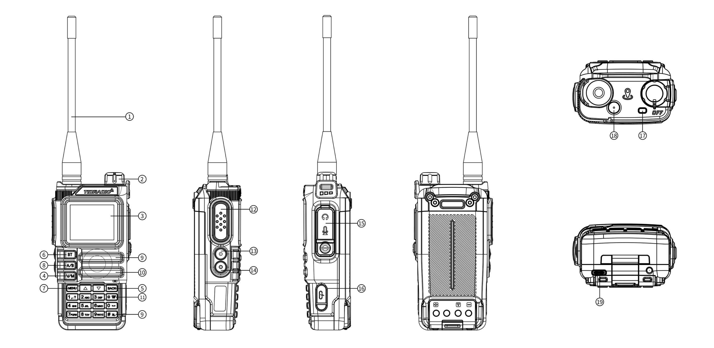

### 4.1 Кнопки и органы управления

> Номера соответствуют цифрам на схеме выше.

| # | Описание |
|---|---|
|1. |**Антенна.**|
|2. |**Ручка питания / громкости** — поворот вкл/выкл и регулировка громкости.|
|3. |**ЖК-экран 1,77".**|
|4. |**VFO/MR** — переключение «Канальный режим» / «Частотный режим».|
|5. |**BACK** — назад/выход.|
|6. |**Клавиша Bluetooth** — долгое нажатие вкл/выкл Bluetooth.|
|7. |**MENU** — короткое нажатие вход в меню.|
|8. |**A/B** — переключение диапазонов A/B.|
|9. |**Динамик.**|
|10. |**Микрофон.**|
|11. |**DTMF / блокировка клавиатуры** — долгое нажатие вкл/выкл блокировки клавиатуры.|
|12. |**PTT** — тангента: удерживать, чтобы говорить; отпустить — приём.|
|13. |**PF1 — настраиваемая боковая клавиша 1.**:|
|--- | - Короткое нажатие: MENU → Radio Setting → пункт 27 (варианты: NONE, FM Radio, Lamp, TONE, Alarm, Weather, PTT2, OD PTT).|
|--- | - Долгое нажатие: MENU → Radio Setting → пункт 28 (NONE, FM Radio, Lamp, Cancel Sq, TONE, Alarm, Weather).|
|14. |**PF2 — настраиваемая боковая клавиша 2.**:|
|--- | - Короткое нажатие: MENU → Radio Setting → пункт 29.|
|--- | - Долгое нажатие: MENU → Radio Setting → пункт 30.|
|15. |**Разъём MIC/SP** — внешняя гарнитура.|
|16. |**USB-C порт** — программирование.|
|17. |**Индикатор:** красный — передача; зелёный — приём.|
|18. |**Оранжевая клавиша Weather** — вход в режим NOAA-погоды.|
|19. |**USB-C разъём зарядки** на аккумуляторе.|

### 4.2 ЖК-дисплей. Значки

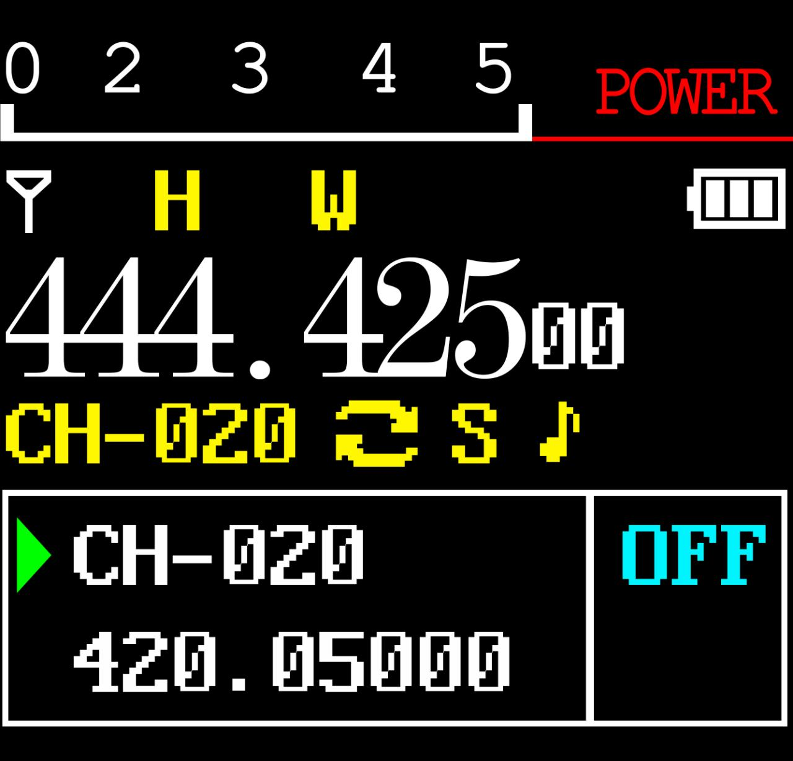

Значки в порядке таблицы из руководства:
| # | Символ | Описание |
|---|---|---|
|1. | |Индикатор силы сигнала (4 уровня).|
|2. | |Высокая мощность передачи /  низкая мощность передачи.|
|3. | |Звук голоса/клавиш (не показывается, если оба выключены).|
|4. | |Текущий тон: DCS или  CTCSS.|
|5. | |Офсет «вверх» (TX выше RX) — доступ к репитеру в режиме VFO.|
|6. | |Офсет «вниз» (TX ниже RX).|
|7. |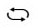 |Двойное наблюдение (dual watch) включено.|
|8. | |Клавиатура заблокирована; удерживайте  для разблокировки.|
|9. |[S] |Энергосбережение включено.|
|10. |[N] |Канал в узкополосном режиме.|
|11. |[W] |Канал в широкополосном режиме.|
|12. | |Уровень заряда батареи; при разрядке  рамка значка мигает  (передача невозможна).|
|13. | |Значок OD-передачи.|
|14. | |Значок OD-приёма.|
|15. | |Bluetooth включён, не подключён (белый значок).|
|16. | |Bluetooth подключён (синий значок).|
|17. | |Индикатор громкости.|

### 4.3 Светодиодные индикаторы

| Цвет | Индикатор | Состояние рации |
|---|---|---|
| 🔴 | Постоянно красный | Передача |
| 🟢 | Постоянно зелёный | Приём |

### 4.4 Основные клавиши управления

| Клавиша | Описание |
|---|---|
| **BT** | долгое нажатие: вкл/выкл Bluetooth.|
| **MENU** | вход в меню, выбор пункта, подтверждение параметра.|
| **▲** | нажатие: шаг вверх по каналу/частоте; удержание более 2 с: быстрое перемещение вверх; в режиме сканирования: перемещение сканирования вверх.|
| **▼** | нажатие: шаг вниз по каналу/частоте; удержание более 2 с: быстрое перемещение вниз; в режиме сканирования: перемещение сканирования вниз.|
| **VFO/MR** |  переключение между частотным (VFO) и канальным (MR) режимами. Сохранение частот в память возможно только в режиме VFO.|
| **BACK** | выход из меню и функций.|
| **A/B** | переключение между верхним (A) и нижним (B) дисплеем; выбранный становится активным для приёма и передачи. Сохранение в память работает с дисплея A.|
| **Цифровая клавиатура** | ввод информации/выборов; при передаче цифровые клавиши отправляют соответствующие DTMF-коды.|
| **# (DTMF/блокировка)** | короткое нажатие: активация DTMF-набора; удержание более 2 с: блокировка/разблокировка клавиатуры.|

### 4.5 Дополнительные комбинации клавиш и включения

**Комбинации при включении питания (Power On):**

| Комбинация | Функция |
|---|---|
| PTT + * + Включение | Переключение режима: GMRS / HAM / Standard |
| PTT + 1 + Включение | Прошивка через K-кабель |
| PTT + 3 + Включение | Прошивка через USB (или удерживать 8 кн) |
| PTT + 7 + Включение | Обновление APRS |

**Клавиши в режиме ожидания:**

| Действие | Функция |
|---|---|
| Удержание 1 | Детектор (счётчик) частоты |
| Удержание 3 | Сканер |
| Удержание 7 | Спектроанализатор |
| Удержание * | Блокировка клавиатуры (Keylock) |

**Режим гарнитуры (Bluetooth-звонки):**

| Действие | Функция |
|---|---|
| 1 | Ответ на звонок телефона |
| Удержание 4 | Перезвонить |
| 3 / PTT | Повесить трубку |

**Режим колонки (Bluetooth-аудио):**

| Действие | Функция |
|---|---|
| 1 | Предыдущий музыкальный трек |
| 2 | Проигрывание / пауза |
| 3 | Следующий музыкальный трек |

### 4.6 Цифровая клавиатура

С помощью этих клавиш можно вводить информацию или выбирать настройки на радиостанции.   
В режиме передачи (TX) нажмите цифровые клавиши для отправки соответствующего DTMF-кода.   
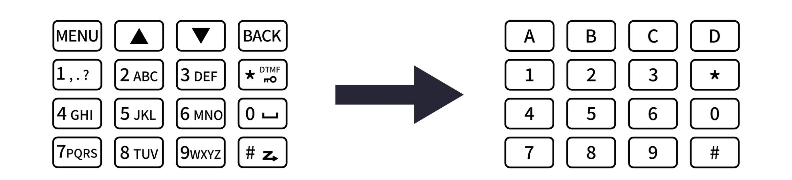    

Нажмите , чтобы активировать функцию тонового набора (DTMF).    
Нажатие и удержание  более 2 секунд позволяет заблокировать или разблокировать клавиатуру.

## 5. Базовые операции

### 5.1 Включение

Поверните ручку питания/громкости по часовой стрелке до щелчка. Через ~1 сек двойной звуковой сигнал, отображение сообщения/заставки, затем частота или канал. При включённых голосовых подсказках будет объявлен режим. Выключение — против часовой стрелки до щелчка.

### 5.2 Громкость

Поворот ручки по/против часовой стрелки.

### 5.3 Выбор канала

Два режима: **VFO (частотный)** — для эксперимента и быстрого программирования «в поле»; **MR (канальный)** — для повседневного использования заранее запрограммированных каналов. Переключение клавишами ▲/▼ или энкодером.

### 5.4 Вызов

- **Канальный режим:** выберите канал, удерживайте [PTT] и говорите (красный индикатор). Приём — автоматически при отпускании PTT (зелёный индикатор).
- **Частотный режим:** нажмите [V/M], введите частоту (в пределах диапазона), удерживайте [PTT].
- Держите микрофон на расстоянии 2,5–5 см от рта.

### 5.5 Частотный режим (VFO)

Перемещение по частоте клавишами ▲/▼ (с шагом, заданным в настройках) или прямой ввод частоты с цифровой клавиатуры с точностью до килогерц.

Пример: ввод частоты 432,56250 МГц на дисплее A:
1. В режиме ожидания переключитесь в частотный режим (VFO).
2. Введите на клавиатуре: [4] [3] [2] [5] [6] [2] [5] [0].

> В режиме VFO отображается иконка VFO. Передача на запрещённых частотах незаконна; слушать, как правило, разрешено. Уточняйте требования у местного регулятора.

### 5.6 Канальный режим (MR)

Зависит от запрограммированных каналов. Навигация — клавишами ▲/▼ или энкодером. В режиме MR отображается номер канала CH-XXX.

---

## 6. Дополнительные функции

### 6.1 Сканирование частот

1. В частотном режиме удерживайте клавишу **[3 SCAN]** более 2 секунд — начнётся сканирование с заданным шагом.
2. Остановка — клавиша **[V/M]**.
3. Настройки: MENU → Scan → №1.

### 6.2 Сканирование каналов

1. В канальном режиме удерживайте **[3 SCAN]** более 2 секунд.
2. Направление — клавиши ▲/▼.
3. Остановка — **[V/M]**.

### 6.3 Сканирование CTCSS/DCS

В режиме ожидания: MENU → Scan → «SEEK DCS» — выбор сканирования CTCSS или DCS. Функция недоступна в канальном режиме; сканирование начнётся только при обнаружении сигнала.

### 6.4 Программирование каналов вручную

199 каналов памяти, каждый хранит: частоту приёма, групповой сигнал (тоны), ширину канала, ANI/PTT-ID, шестисимвольное имя канала. Сохранение: MENU → Program Channel → пункт 12 (Memory CHL).

**Режимы:** VFO — частота; MR — каналы. Для сохранения — переключиться в VFO клавишей VFO/MR.

**Пример 1. Канал 31 с тоном CTCSS 123,0 Гц (RX 432,55000 МГц):**
1. Нажмите [VFO/MR] — режим VFO.
2. [Menu] → Program Channel → [1] [3] [Menu] — удалить прежние данные канала (например, 31) → OK.
3. [Back] → [2] [Menu] → ALTER → CTCSS → 123,0 [Menu] [Back] — выбрать TX-тон.
4. Введите RX-частоту (43255000).
5. [Menu] → Program Channel → [1] [2] — введите номер канала (31) → [Back] — RX добавлен.
6. Нажмите [VFO/MR] — возврат в MR-режим.

**Пример 2. Поиск частоты сканированием (запись канала 31):**
1. Нажмите [V/M] — режим MR (значок CH-XXX).
2. Удерживайте **[3 SCAN]** — сканирование.
3. При активности на 432,55000 МГц нажмите [PTT] — остановка.

### 6.5 Аварийный сигнал (Emergency Alert)

Заранее назначьте на боковую клавишу [PF1] или [PF2] функцию Alarm, затем нажмите эту клавишу — рация издаст громкий сигнал, а фонарик замигает. Выход — нажать [PTT].
**ВНИМАНИЕ:** использовать только в реальной чрезвычайной ситуации.

### 6.6 FM-радио

Заранее назначьте на [PF1]/[PF2] функцию FM Radio. Диапазон 87–108 МГц.
1. Нажмите [PF1]/[PF2] — включение радио.
2. Выбор частоты — клавишами ▲/▼ или вводом.
3. Повторное нажатие — выход.
Примечание: при пропадании сигнала рация автоматически возвращается в FM-режим; при звонке переключается в режим приёма.

### 6.7 NOAA-погода

11 каналов NOAA. Клавиша: оранжевая **Weather**.
1. Нажмите оранжевую клавишу — вход в режим NOAA.
2. Выбор канала — ▲/▼.
3. Повторное нажатие — выход.

Каналы: Wx-01…Wx-11 (162,5500; 162,400; 162,475; 162,425; 162,450; 162,500; 162,525; 161,650; 161,775; 161,750; 162,000 МГц). Только приём, передача невозможна.

### 6.8 Тон репитера (1000 / 1450 / 1750 / 2100 Гц)

Заранее назначьте на [PF1]/[PF2] функцию TONE, выберите частоту тона в пункте 24 Radio Setting. Нажмите [PF1]/[PF2] — будет отправлен тон репитера. Работает даже при заблокированной клавиатуре.

### 6.9 Функция вызова (Bluetooth-звонки)

1. Включите Bluetooth: MENU → Bluetooth → BT ON/OFF (или длинным нажатием MENU).
2. Подключите телефон (имя: MENU → Bluetooth → BT Name — TD-H9xxxx).
3. Входящий звонок — короткое нажатие клавиши **1** — ответить.
4. В режиме ожидания длинное нажатие клавиши **4** — перезвонить.
5. Во время разговора короткое нажатие **3** или **PTT** — завершить.

### 6.10 Функция «Аудио» (музыка через рацию)

1. Включите Bluetooth, подключите телефон.
2. Клавиша **1** — предыдущий трек; **3** — следующий трек; **2** — длинное/короткое нажатие — пауза/воспроизведение.

### 6.11 OD PTT (Odmaster PTT)

1. Включите Bluetooth (MENU → Bluetooth → BT ON/OFF или длинное нажатие [MENU]).
2. Подключите телефон.
3. После подключения боковая клавиша PF1 автоматически становится OD PTT и вернёт прежнюю функцию после отключения.
4. Убедитесь, что режим «Receiver» (MENU → Bluetooth → BT Mode).
5. Задайте OD PTT: OD (только OD) или OD+Analog (OD и одновременно аналогичные рации на той же частоте).
6. Откройте приложение Odmaster, войдите в группу.
7. Нажмите OD PTT для разговора.

**Пошаговые иллюстрации настройки и работы OD PTT (страницы из руководства):**

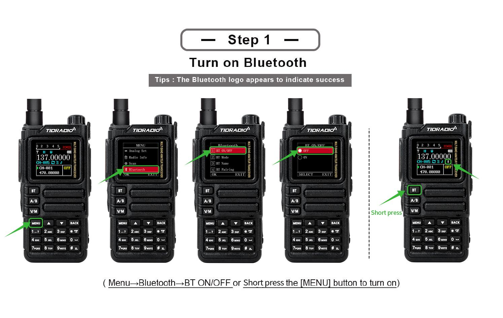
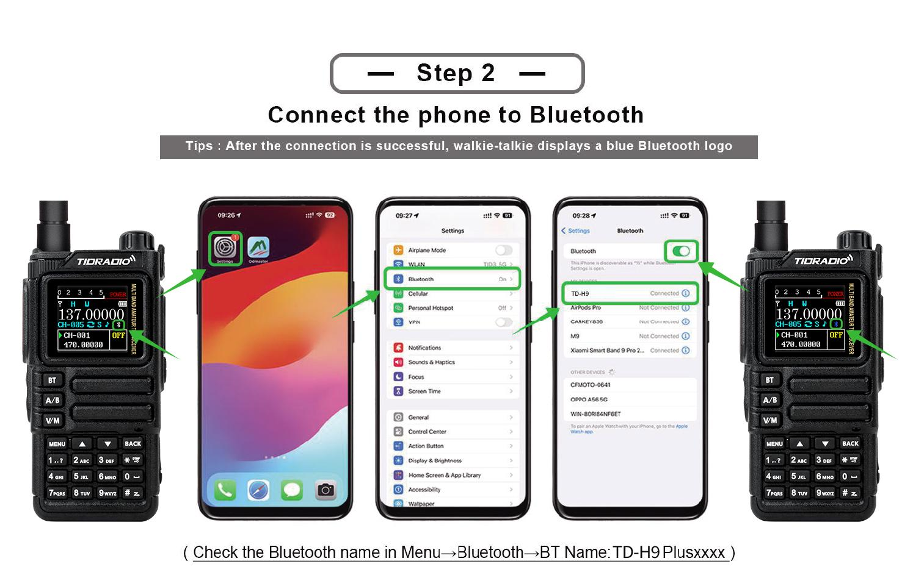
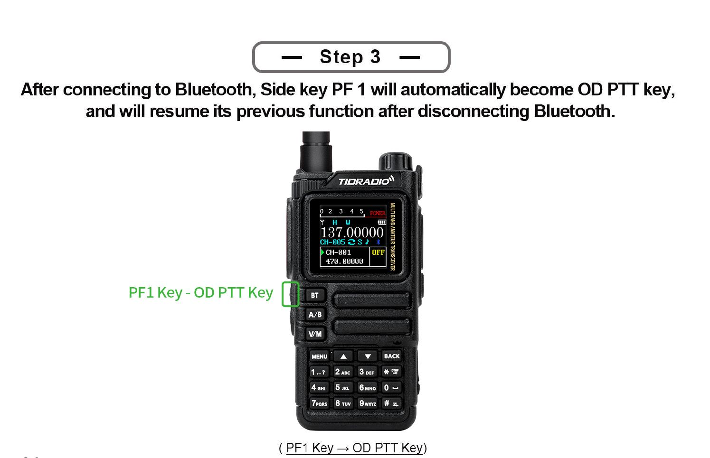
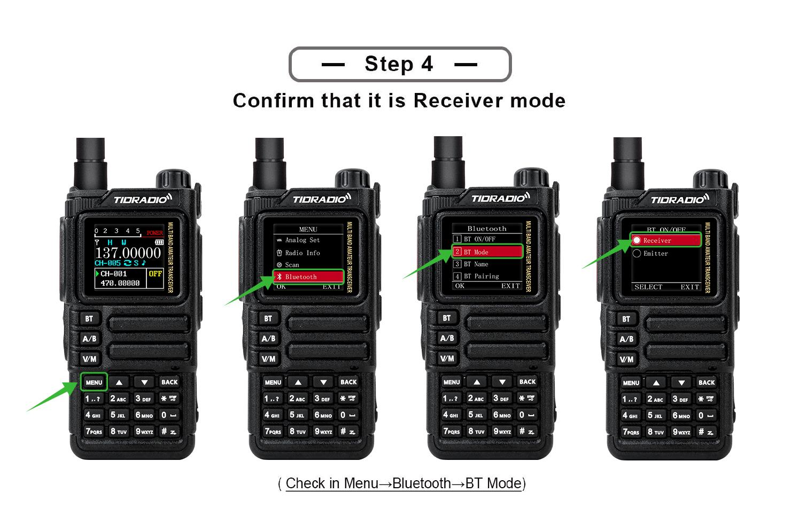
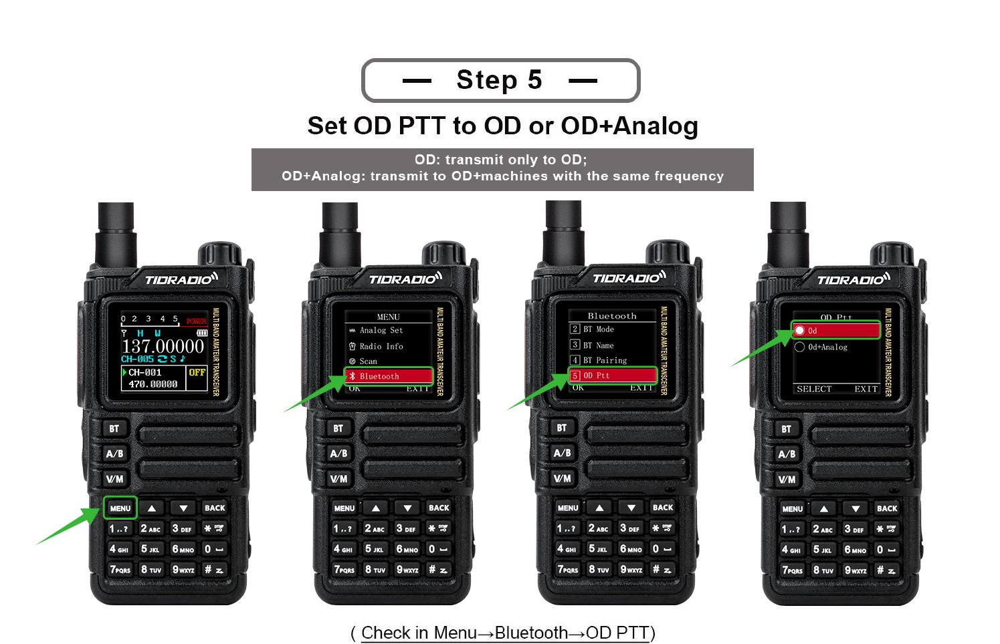
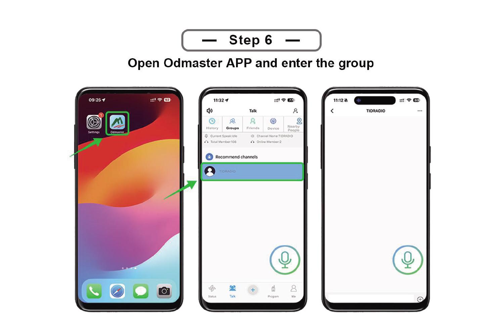
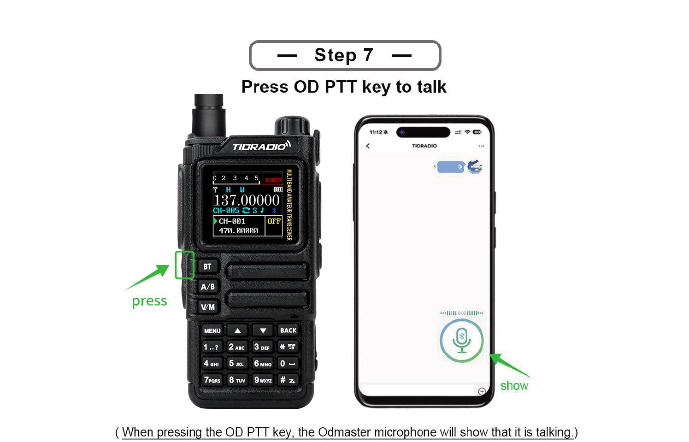

### 6.12 Программирование по Bluetooth

(Раздел с пошаговыми иллюстрациями; см. оригинал мануала — программирование рации через Bluetooth-соединение с ПО.) Подключите рацию по Bluetooth и используйте ПО программирования.

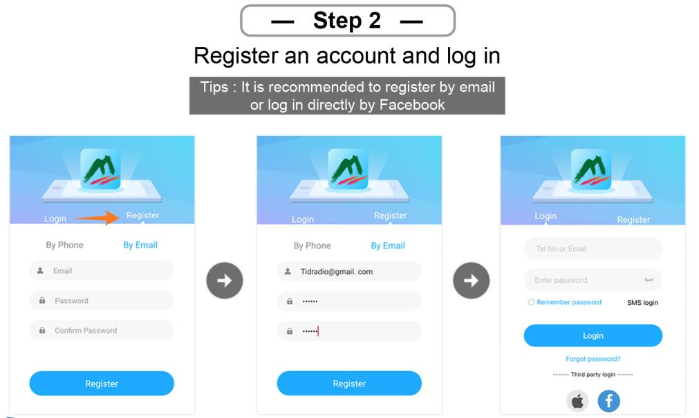
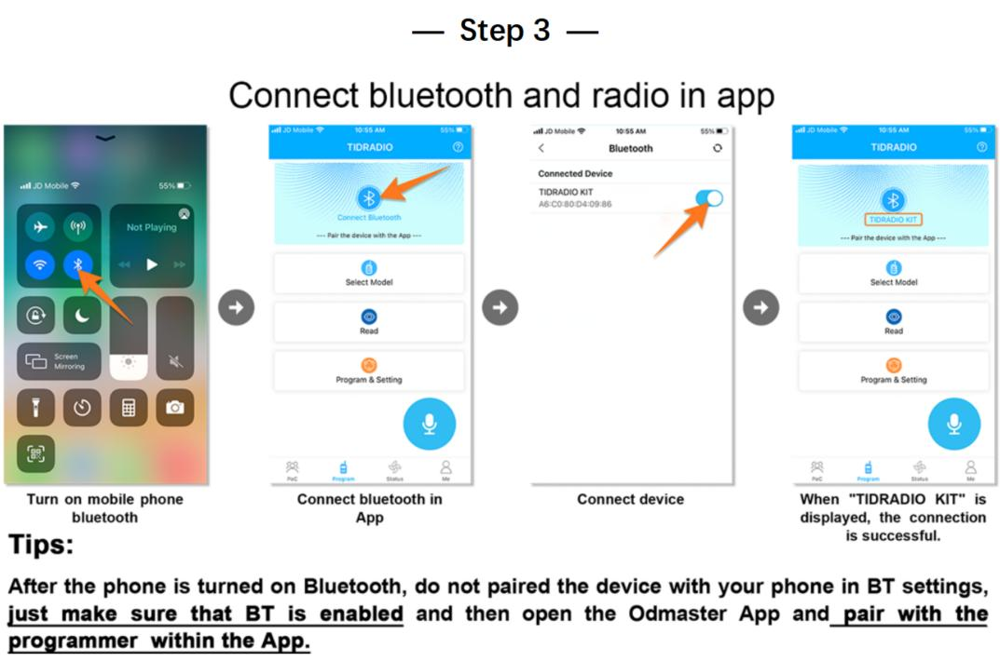
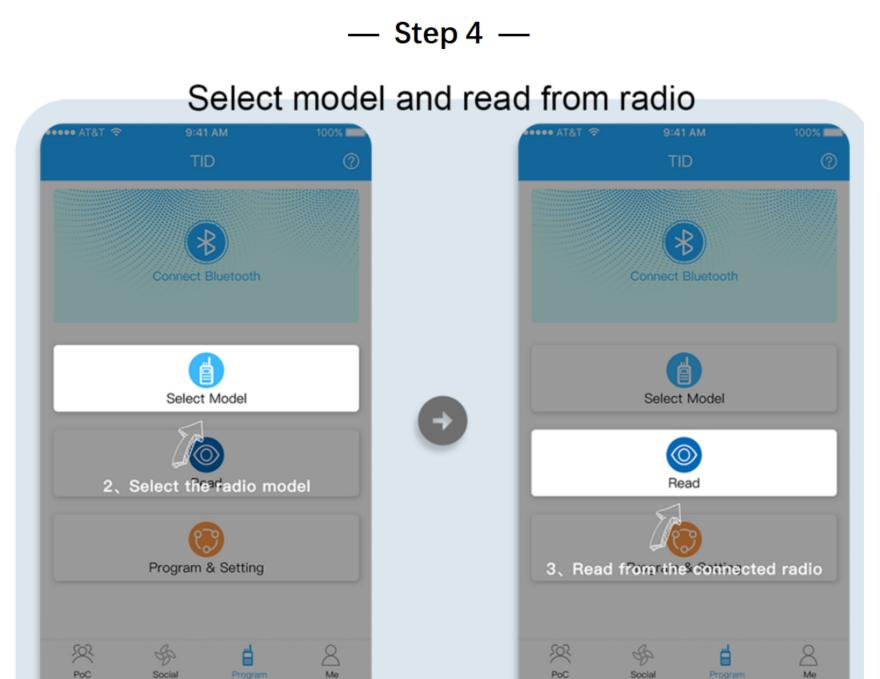

---

## 7. Работа с меню

> В канальном режиме недоступны: тоны CTCSS/DCS, ширина канала, PTT-ID, BCL, редактирование имени канала.

### 7.1 Основное использование

1. Нажмите [MENU] — вход в меню.
2. ▲/▼ — перемещение по пунктам.
3. [MENU] — выбор пункта.
4. ▲/▼ — выбор параметра.
5. [MENU] — подтвердить и вернуться в меню; [BACK] — отменить и выйти из меню.
6. [BACK] — выход из меню в любой момент.

### 7.2 Короткие команды (шорткаты)

1. Нажмите [MENU].
2. Введите номер пункта цифровой клавиатурой.
3. [MENU] — войти в пункт.
4. Параметр: ▲/▼ или числовой шорткод.
5. [MENU] — сохранить; [BACK] — отменить.
6. [BACK] — выход.

### 7.31 Radio Setting (Настройки радио)

| № | Функция | Описание |
|---|---|---|
| 1 | Squelch LV | Уровень шумоподавителя 1–9 (1 — самый низкий, 9 — самый высокий). По умолчанию 4. |
| 2 | Step Freq | Шаг частоты: 0,5/2,5/5,0/6,25/10,0/12,5/25,0/50,0 кГц. В канальном режиме не меняется. |
| 3 | VOX Level | Уровень голосовой активации: Off, 1–5. |
| 4 | VOX Delay | Задержка VOX: 1,0/2,0/3,0 с. |
| 5 | TOT | Таймер ограничения передачи: off/30/60/90/120/150/180/210 с. |
| 6 | Roger Beep | Звуковой сигнал при отпускании PTT. |
| 7 | Beep | Звук клавиш. |
| 8 | Power Save | Энергосбережение: Off, 1:1 / 1:2 / 1:3 / 1:4 (работа : сон). |
| 19 | DTMF Set | DTMF-сигналы при передаче: OFF/ON. |
| 21 | Language | Английский / Китайский (English / Chinese). |
| 22 | Alarm Mode | On Site (только локальный сигнал, фонарик мигает) / TX Alarm (звук 10 с, пауза 2 с, цикл). |
| 23 | Side Tone (Tail) | Подавление «хвоста»: ON/OFF (метод задаётся CPS). |
| 24 | Tone Burst (TBST) | Тон репитера: 1000/1450/1750/2100 Гц. Отправка — боковой клавишей (TONE). |
| 25 | Talk Around | OFF: вне покрытия репитера — «failed to activate relay»; ON: TX = RX, на экране «\|→\|». |
| 26 | FM Interrupt | OFF: в FM-режиме звонок не прерывает; ON: при звонке FM прерывается на 5 с. |
| 27 | PF1 S Press | Короткое нажатие PF1: NONE, FM Radio, Lamp, TONE, Alarm, Weather, PTT2, OD PTT. |
| 28 | PF1 L Press | Долгое нажатие PF1: NONE, FM Radio, Lamp, Cancel Sq, TONE, Alarm, Weather. |
| 29 | PF2 S Press | Короткое нажатие PF2: аналогично п. 27. |
| 30 | PF2 L Press | Долгое нажатие PF2: аналогично п. 28. |
| 31 | Factory R | Сброс: VFO (только частотные настройки), CHL (только каналы), FULL (всё). |
| 32 | Breath Led | Частота мигания светодиода в режиме ожидания. |
| 33 | MIC GAIN | Усиление микрофона: 0–9. |
| 34 | DTMF Speed | Скорость DTMF (по умолчанию 110 мс). |
| 35 | DCD | OFF: DTMF-сигнализация выкл. ON: включить DTMF-вызов/групповой вызов. |
| 36 | D-HOLD | Время автосброса DTMF: 5–60 с. |
| 37 | D-RSP | Ответ DTMF: NULL / RING / REPLY / BOTH. |
| 38 | AM_BAND | ON: AM-модуляция для 108–136 МГц (авиация); OFF: FM. Действует только для 108–136 МГц. |
| 39 | 200TX | ON: открыть диапазон 220–260 МГц в режиме VFO. |
| 40 | 350TX | ON: открыть диапазон 350–390 МГц в режиме VFO. |
| 41 | 500TX | ON: открыть верх UHF (до 520 МГц) в режиме VFO. |

### 7.32 Program Channel (Программирование канала)

| № | Функция | Описание |
|---|---|---|
| 1 | RX Sub-audio | Тон приёма: CTCSS (67,0–254,1), DCS (D023N–D754N), Reverse DCS (D023I–D754I). |
| 2 | TX Sub-audio | Тон передачи: аналогично. |
| 3 | Bandwidth | Wide (25 кГц) / Narrow (12,5 кГц). |
| 4 | TX Power | Low / Middle / High. |
| 5 | Busy Lock | BCL: OFF — передача разрешена при занятом канале; ON — запрещена. |
| 6 | Call Code | 8 групп кодов сигнализации (редактируются с ПК). |
| 7 | PTT-ID | Отправка ANI-ID: OFF / BOT (при нажатии PTT) / EOT (при отпускании) / BOTH. |
| 8 | Scan Add | ON — канал участвует в сканировании; OFF — не участвует. |
| 9 | Scramble | Скремблирование голоса (одинаковое у обоих). |
| 10 | OFFSET | Офсет TX/RX: 0,000–99,998 МГц. |
| 11 | SET-D | Направление офсета: OFF / Positive / Negative. |
| 12 | Memory CHL | Сохранение канала (заданные параметры сохранить до записи). |
| 13 | Delete CHL | Удаление канала. |
| 14 | Hopping | Скачкообразная перестройка частоты: ON/OFF (защита от помех со стороны группы). |

### 7.33 Analog Set

| № | Функция | Описание |
|---|---|---|
| 1 | Frequency Calibration | Калибровка: UHF / VHF диапазон. |
| 2 | AM Volume Level | Уровень громкости AM: 1–5. |

### 7.34 Radio Information

| № | Функция |
|---|---|
| 1 | Versions Info | Radio ID, Radio Alias, версия прошивки, версия железа. |
| 2 | APRS Info | APRS Call, версия прошивки APRS, версия железа APRS. |

### 7.35 Scan (Сканирование)

| № | Функция | Описание |
|---|---|---|
| 1 | Scan Mode | TO / (CO) / SE (по умолчанию CO). |
| 2 | SEEK DCS | Сканирование частот с DCS/CTCSS/R-DCS. Недоступно в канальном режиме. |
| 3 | Hang Time | Время удержания при обнаружении сигнала: шаг 0,5 с, по умолчанию 1 с. |
| 4 | Scan Freq | Быстрый поиск частоты одним касанием: 1) длинное нажатие клавиши 1 — вход; 2) ▲/▼ — выбор канала для сохранения; 3) на экране частота и DCS при передаче; 4) дождитесь завершения; 5) [Menu] — подтвердить/сохранить, клавиша * — переснять. |

### 7.36 Bluetooth

| № | Функция | Описание |
|---|---|---|
| 1 | BT ON/OFF | Вкл/выкл Bluetooth. |
| 2 | BT Mode | Receiver (рация — приёмник, подключается к телефону; имя TD-H9 XXXX, не подключаться к суффиксу BLE) / Emitter (рация — источник; спаривание через пункт 4). Совместимые аксессуары: Bluetooth PTT, MIC, гарнитура. |
| 3 | BT Name | Имя: TD-H9xxxx. |
| 4 | BT Pairing | Pairable (поиск устройств) / Paired (список сопряжённых). |
| 5 | OD PTT | OD (только Odmaster) / OD + Analog (одновременно с аналоговой передачей). |
| 6 | OD Mode | Local Mode (звук через рацию; по умолчанию) / Forward Mode (пересылка на другие рации/платформы) / Full Mode (оба). |
| 7 | BT Int MIC | Переключатель усиления Bluetooth-микрофона: OFF/ON. |
| 8 | BT Int Spk | Переключатель усиления Bluetooth-динамика: OFF/ON. |
| 9 | BT MIC Gain | Усиление BT-микрофона: 1–5. |
| 10 | BT Spk Gain | Усиление BT-динамика: 1–5. |
| 11 | BT Pin Code | PIN-код сопряжения: 0000 / 123456. |

### 7.37 Обновление прошивки

1. Войдите: [web.odmaster.net](https://web.odmaster.net/).
2. Remote Control Program → Upgrade Firmware.
3. Следуйте шагам на экране.

### 7.38 GNSS (GPS)

| № | Функция | Описание |
|---|---|---|
| 1 | GPS ON/OFF | Вкл/выкл GPS. |
| 2 | GPS Information | Антенна, долгота, широта, дата, время, высота, курс, скорость, спутники. |
| 3 | Position | Формат координат: (D) / DM / DMS — Deg, Deg.min, Deg.min.s. |
| 4 | Time Zone | Часовой пояс UTC-12…UTC+12 (по умолчанию +3). |
| 5 | Speed Unit | Единицы скорости: (Kmph) / Knot / Mpt. |
| 6 | Distance Unit | Единицы расстояния: (Km) / Sea / Mile. |
| 7 | Altitude Unit | Единицы высоты: (M) / Ft. |
| 8 | Fixed Latitude | Фиксированная широта (пример по умолчанию 44° 35' 04" — ▲/▼ выбор, [#] подтверждение). |
| 9 | Fixed Longitude | Фиксированная долгота (пример 40° 06' 38"). |
| 10 | Fixed Altitude | Фиксированная высота (по умолчанию 0). |

### 7.39 Site Type (Тип позиции)

- **Fix Coordinates** — фиксированные координаты.
- **GPS Coordinates** — координаты по GPS.

### 7.40 APRS

| № | Функция | Описание |
|---|---|---|
| 1 | APRS Switch | Вкл/выкл APRS. |
| 2 | Beacon Set | Настройка маяка: |
| - | .. | **Call Sign** - радиолюбителький позывной (до 6 символов, заглавные латиница+цифры; ▲/▼ выбор символа, confirm — ввод, back — удаление, # — сохранить)| 
| - | .. | **SSID** (0–15, по умолчанию 11)|
| - | .. | **SSID Symbol** (/ или \)|
| - | .. | **Custom Information** - комментарий к APRS-пакету, до 60 англ символов ASCII |
| - | .. | **Icon Settings**|
| - | .. | **MIC Start** (On/Off)|
| - | .. | **MIC Type** (MO: Off Duty / M1: En Route / M2: In Service / M3: Returning / M4: Committed / M5: Special / M6: Priority / M7: Emergency)|
| - | .. | **Route 1**: Используйте кнопки ▲/▼ для выбора символа. Нажмите кнопку подтверждения, чтобы выбрать его. Если вы допустили ошибку, нажмите кнопку возврата для удаления|
| - | .. | **Route 1 Count**: (0–9)|
| - | .. | **Route 2**: Используйте кнопки ▲/▼ для выбора символа. Нажмите кнопку подтверждения, чтобы выбрать его. Если вы допустили ошибку, нажмите кнопку возврата для удаления|
| - | .. | **Route 2 Count**: (0–9)|
| - | .. | **Report Voltage** -отправлять инф-ию о батарее (по умолчанию ON)|
| - | .. | **Report Sats** -отправлять инф-ию о спутниках (по умолчанию ON)|
| - | .. | **Report Mileage** -отправлять инф-ию о пробеге (по умолчанию OFF)|
| 3 | Beacon Type | Настройка передачи маяка: |
| - | .. | **PTT Linkage** (маяк при каждом нажатии/отпускании PTT; по умолчанию OFF)|
| - | .. | **Timed Beacon** - отправлять инф-ию с заданной периодичностью (по умолчанию ON)|
| - | .. | **Timing** — интервал в секундах, например 0090 = каждые 90 с (ввод цифрами + [#]). |
| 4 | Relay Set | Настройки режима APRS-репитера: |
| - | .. | **DIGI Forward CH** - на какой канал ретранслировать пакеты (A / (B) / AB)|
| - | .. | **DIGI1 Enable** (по умолчанию OFF)|
| - | .. | **DIGI1 Name** (по умолчанию WIDE1), до 6 символов ASCII: заглавные буквы и цифры|
| - | .. | **DIGI2 Enable** (по умолчанию OFF)|
| - | .. | **DIGI2 Name** (по умолчанию WIDE2), до 6 символов ASCII: заглавные буквы и цифры|
| - | .. | **Wait Before Forwarding** - задержка перед ретрансляцией (0–9c). При наличии нескольких ретрансляторов позволяет разнести время передачи и избежать коллизий маяков в эфире|
| - | .. | **Remote Password** - пароль удаленного управления репитером через KISS (TNC) (по умолчанию 123456). |
| 5 | Advanced Set | Расширенные настройки приема/передачи: |
| - | .. | **APRS RX CH** - на каком канале принимать APRS (OFF / A / (B))|
| - | .. | **APRS TX CH** - на каком канале передавать APRS (OFF / A / (B))|
| - | .. | **PTT Priority** - приоритет при одновременной передаче голоса/APRS (Talk / (APRS))|
| - | .. | **RX Decode Tone** - звуковой сигнал при успешном приеме и декодировании APRS (по умолчанию ON)|
| - | .. | **TX Tone** - звуковой сигнал при передаче APRS (по умолчанию OFF)|
| - | .. | **Beacon Auto Popup** (по умолчанию ON) - выводить экран с информацией о полученном маяке |
| 6 | Beacon List | Список маяков: до 100 принятых; управление/удаление. |
| 7 | APRS Reset | Сброс APRS к заводским настройкам. |

### 7.41 Подробное описание функций APRS

| # | Топик | Описание |
|---|---|---|
|1|**Каналы APRS**| Каналы A/B могут быть назначены на APRS или голос; поддерживаются режимы: | 
|.|..| - приём+передача на A|
|.|..| - приём A / передача B (кроссрепитер)|
|.|..| - только приём A|
|.|..| - одновременная передача A и B|
|.|..| - приём+передача на B|
|.|..| - приём B / передача A (кроссрепитер)|
|.|..| - только приём B|
|.|..| Поддерживается работа вне сети (без интернета и сотовой связи) — рации определяют позиции друг друга напрямую.|
|2|**Bluetooth**| Поддержка KISS TNC поверх Bluetooth; данные могут разбираться и отображаться или загружаться в сеть через Odmaster.|
|3|**APRS Relay (DIGI)**| Полная DIGI-ретрансляция с настраиваемыми именами; включение/отключение удалённо.|
|4|**MIC-E**| Маяки сжимаются и передаются в формате MIC-E — короче время в эфире, меньше коллизий, выше вероятность успешного декодирования.|
|5|**PTT Delay**| Настраиваемая задержка между нажатием PTT и началом передачи (полезно при медленном шумоподавителе удалённой станции).|
|6|**Цифровая ретрансляция APRS**| Два имени ретранслятора: по умолчанию WIDE1 и WIDE2 (до 6 символов, цифры или заглавные буквы). Правило: при приёме валидного маяка, содержащего имя ретранслятора и счётчик переходов > 1, рация пересылает пакет один раз, уменьшая счётчик на 1. При счётчике 0 пакет не пересылается. Каждый переход — полный цикл приём → декод → перекодирование → передача. Счётчик ограничивает бесконечное распространение. [Подробнее...](http://wa8lmf.net/DigiPaths/) |
|7|**Удалённый пароль**| По умолчанию **123456** (6 цифр).|
|8|**Фиксированная станция**| При типе Fix Coordinates для расчёта дистанции/пеленга используются заданные координаты.|
|9|**Карты/просмотр треков**| ... |
|.| Odmaster: | - https://web.odmaster.net/login. |
|.| APRS.fi | - https://aprs.fi/ |
|.| APRS.to | - https://aprs.to/ |
|.| APRS Map Info | - https://aprs-map.info/ |

### 7.42 Удаленное управление репитером APRS

Вы можете отправить управляющий пакет с любой другой радиостанции или смартфона, подключенного к трансиверу, оформив его как стандартное APRS-сообщение (APRS Message), адресованное позывному вашей радиостанции (например, N0CALL-9). В тексте сообщения вводится комбинация [пароль][команда] (например, 123456A1). Если радиостанция успешно примет и декодирует посылку, она изменит режим работы встроенного дигипитера. 

Пароль строго должен состоять из 6 цифр. Чтобы трекер выполнил команду, сообщение должно содержать ваш пароль, а затем саму команду (без пробелов)

Доступные удаленные команды:
|Команда|Что делает|
|---|---|
|A1|Включить репитер 1 (DIGI 1 — активация функции дигипитера)|
|A0|Выключить репитер 1 (DIGI 1)|
|B1|Включить репитер 2 (DIGI 2)|
|B0|Выключить репитер 2 (DIGI 2)|
|R0|Сбросить текущие настройки и перезагрузить устройство с параметрами из энергонезависимой памяти EEPROM|

### 7.43 Ретрансляция APRS-пакетов дигипитером

APRS-ретрансляция — это процесс: приём → декодирование → перекодирование → отправка. При каждой ретрансляции качество сигнала остаётся наилучшим, в отличие от традиционной аналоговой голосовой ретрансляции.

Благодаря тому, что маяк содержит указанное количество ретрансляций, бесконечной ретрансляции не происходит.

В режиме работе дигипитера радиостанция при приеме APRS-пакета ищет в его PATH имя установленного дигипитера, и если находит, то пересылает далее в эфир этот пакет, декрементируя SSID на единицу, но только в том случае если SSID больше нуля. 

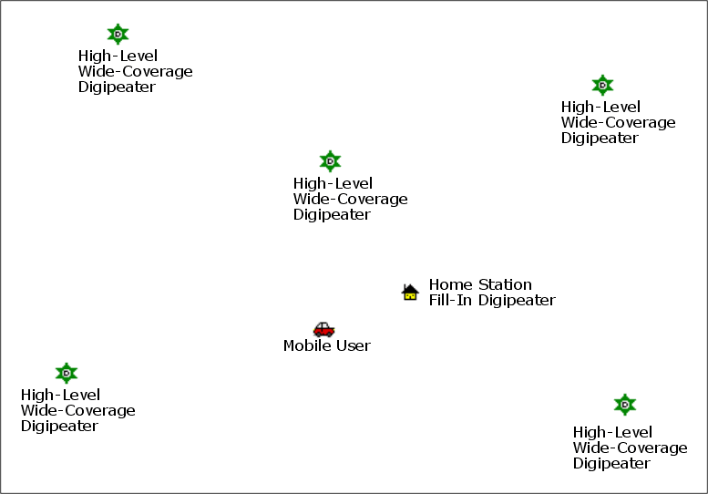

### 7.44 APRS Worldwide Частоты

| Частота | Описание |
|---|---|
| 144.3900 MHz  | North America: United States, Canada, Chili |
| 144.3900 MHz  | Indonesia, Singapore, Malaysia |
| 144.3900 MHz  | Thailand (https://www.qsl.net/rast/text/2mbandplan.htm) 
| 144.3900 MHz  | Mexico, Dominican Republic, Puerto Rico, Trinidad & Tobago, Columbia |
| 144.8000 MHz  | Europe, UK, Ireland, Iceland, **Россия** |
| 144.8000 MHz  | South Africa, Azores, Costa Rica, Israel, Lebanon, Senegal |
| 145.1750 MHz  | Australia, Tasmania |
| 144.5750 MHz  | New Zealand  |
| 144.9300 MHz  | Argentina, Uruguay, Paraguay  |
| 144.6600 MHz  | Japan  |
| 144.6400 MHz  | China, Hong Kong, Taiwan  |
| 144.6200 MHz  | South Korea  |
| 145.5250 MHz  | Thailand (OLD)  |
| 145.5700 MHz  | Brazil  |
| 433.8000 MHz  | Europe (Primary)  |
| 432.5000 MHz  | Europe (Secondary)  |
| 439.1000 MHz  | Australia  |
| 430.5125 MHz  | Netherlands  |
| 432.5750 MHz  | New Zealand  |

> Не используйте вышеперечисленные частоты для передачи голоса!

http://aprs.qrz.ru/freq.php    
https://www.sigidwiki.com/wiki/Automatic_Packet_Reporting_System_(APRS)    
https://aprs.fi/   

### 7.45 Схожая по функционалу APRS-радиостанция

**Lanchonlh HG-UV98**:
* [HG-UV98](https://github.com/dkxce/HG-UV98)
* [lanchonlh_hg-uv98_ru_manual](https://github.com/dkxce/lanchonlh_hg-uv98_ru_manual)

---

## Приложение A. Поиск и устранение неисправностей

| Проблема | Анализ | Решение |
|---|---|---|
| Не включается | Неправильно установлен аккумулятор / разряжен / плохой контакт | Переустановить батарею; зарядить или заменить; почистить контакты |
| Слабый/прерывистый голос при приёме | Низкая громкость / антенна ослаблена или установлена неверно / засорён динамик | Увеличить громкость; выключить и переустановить антенну; почистить динамик |
| Нет связи с группой | Частота или сигналы не совпадают / слишком далеко | Проверить частоты и сигналы; приблизиться |
| Слышны чужие голоса/шум | Помехи на частоте / в аналоговом режиме нет сигнализации | Сменить частоту или поднять шумоподавитель; настроить сигнализацию |
| Никого не слышно (шум) | Большие препятствия / открытая местность / электромагнитные помехи | Перейти на открытую ровную площадку, перезапустить рацию; отойти от источников помех |
| Постоянная передача | Включён VOX или гарнитура не вставлена до конца | Выключить VOX; проверить гарнитуру |

## Приложение B. Технические характеристики

| Параметр | Значение |
|---|---|
| Частотный диапазон (любительский, RX & TX) | 136–173,99 и 400–519,99 МГц (TX/RX также 174–245, 240–260, 290–350, 350–400, 470–520, 520–600 МГц; RX 50–76, 65–108 (FM-радио), 108–136 (AM/FM авиа), 220–260, 350–390 МГц) |
| Каналов памяти | 199 |
| Выходная мощность RF | до 10 Вт (3 уровня: высокая, средняя, низкая) |
| Рабочее напряжение | DC 7,4 В ±10 % |
| Ёмкость аккумулятора | 2400 мА·ч (Li-Ion) |
| Стабильность частоты | ±2,5 ppm |
| Рабочая температура | от -20 °C до +50 °C |
| Режим работы | Симплекс |
| Импеданс антенны | 50 Ом |
| Антенный разъём | На рации SMA-Male, на антенне SMA-Female |
| Разъём гарнитуры | K-Plug (Kenwood 2-pin) |
| Дисплей | 1,77" цветной ЖК, 3 режима отображения, 18 цветов меню |
| GPS | Встроенный GPS/GNSS |
| Bluetooth | Встроенный (для настройки через Odmaster, гарнитуры) |
| APRS | Встроенная поддержка (KISS TNC, DIGI, MIC-E) |
| Спектроанализатор | Встроенный |
| CPU / RAM / Flash | 240 МГц / 120 МБ / 16 МБ |
| Радиочип / МК | Beken BK4819 / PY32F003 |
| Модуляция FM | 11K0F3E @ 12,5 кГц (Narrow band) / 16K0F3E @ 25 кГц (Wide band) |
| Мощность соседнего канала | 60 дБ @ 12,5 кГц |
| Ток передачи | ≤ 1500 мА |
| Чувствительность приёмника | 0,25 мкВ (12 дБ SINAD) |
| Избирательность по соседнему каналу | ≥ 55 дБ @ 12,5 кГц |
| Подавление интермодуляции | ≥ 55 дБ @ 12,5 кГц |
| Паразитное излучение | ≤ -57 дБ @ 12,5 кГц |
| Выходная мощность звука | 1 Вт @ 16 Ом |
| Ток приёма | ≤ 380 мА |
| Искажения звука | ≤ 5 % |
| Габариты (без антенны) | 140 × 53 × 32 мм |
| Вес | 190 г |

## Приложение C. Таблица DCS-кодов

| № | Код | № | Код | № | Код |
|---|---|---|---|---|---|
| 1 | D023N | 2 | D025N | 3 | D026N |
| 4 | D031N | 5 | D032N | 6 | D036N |
| 7 | D043N | 8 | D047N | 9 | D051N |
| 10 | D053N | 11 | D054N | 12 | D065N |
| 13 | D071N | 14 | D072N | 15 | D073N |
| 16 | D074N | 17 | D114N | 18 | D115N |
| 19 | D116N | 20 | D122N | 21 | D125N |
| 22 | D131N | 23 | D132N | 24 | D134N |
| 25 | D143N | 26 | D145N | 27 | D152N |
| 28 | D155N | 29 | D156N | 30 | D162N |
| 31 | D165N | 32 | D172N | 33 | D174N |
| 34 | D205N | 35 | D212N | 36 | D223N |
| 37 | D225N | 38 | D226N | 39 | D243N |
| 40 | D244N | 41 | D245N | 42 | D246N |
| 43 | D251N | 44 | D252N | 45 | D255N |
| 46 | D261N | 47 | D263N | 48 | D265N |
| 49 | D266N | 50 | D271N | 51 | D274N |
| 52 | D306N | 53 | D311N | 54 | D315N |
| 55 | D325N | 56 | D331N | 57 | D332N |
| 58 | D343N | 59 | D346N | 60 | D351N |
| 61 | D356N | 62 | D364N | 63 | D365N |
| 64 | D371N | 65 | D411N | 66 | D412N |
| 67 | D413N | 68 | D423N | 69 | D431N |
| 70 | D432N | 71 | D445N | 72 | D446N |
| 73 | D452N | 74 | D454N | 75 | D455N |
| 76 | D462N | 77 | D464N | 78 | D465N |
| 79 | D466N | 80 | D503N | 81 | D506N |
| 82 | D516N | 83 | D523N | 84 | D526N |
| 85 | D532N | 86 | D546N | 87 | D565N |
| 88 | D606N | 89 | D612N | 90 | D624N |
| 91 | D627N | 92 | D631N | 93 | D632N |
| 94 | D645N | 95 | D654N | 96 | D662N |
| 97 | D664N | 98 | D703N | 99 | D712N |
| 100 | D723N | 101 | D731N | 102 | D732N |
| 103 | D734N | 104 | D743N | 105 | D754N |
| 106 | D023I | 107 | D025I | 108 | D026I |
| 109 | D031I | 110 | D032I | 111 | D036I |
| 112 | D043I | 113 | D047I | 114 | D051I |
| 115 | D053I | 116 | D054I | 117 | D065I |
| 118 | D071I | 119 | D072I | 120 | D073I |
| 121 | D074I | 122 | D114I | 123 | D115I |
| 124 | D116I | 125 | D122I | 126 | D125I |
| 127 | D131I | 128 | D132I | 129 | D134I |
| 130 | D143I | 131 | D145I | 132 | D152I |
| 133 | D155I | 134 | D156I | 135 | D162I |
| 136 | D165I | 137 | D172I | 138 | D174I |
| 139 | D205I | 140 | D212I | 141 | D223I |
| 142 | D225I | 143 | D226I | 144 | D243I |
| 145 | D244I | 146 | D245I | 147 | D246I |
| 148 | D251I | 149 | D252I | 150 | D255I |
| 151 | D261I | 152 | D263I | 153 | D265I |
| 154 | D266I | 155 | D271I | 156 | D274I |
| 157 | D306I | 158 | D311I | 159 | D315I |
| 160 | D325I | 161 | D331I | 162 | D332I |
| 163 | D343I | 164 | D346I | 165 | D351I |
| 166 | D356I | 167 | D364I | 168 | D365I |
| 169 | D371I | 170 | D411I | 171 | D412I |
| 172 | D413I | 173 | D423I | 174 | D431I |
| 175 | D432I | 176 | D445I | 177 | D446I |
| 178 | D452I | 179 | D454I | 180 | D455I |
| 181 | D462I | 182 | D464I | 183 | D465I |
| 184 | D466I | 185 | D503I | 186 | D506I |
| 187 | D516I | 188 | D523I | 189 | D526I |
| 190 | D532I | 191 | D546I | 192 | D565I |
| 193 | D606I | 194 | D612I | 195 | D624I |
| 196 | D627I | 197 | D631I | 198 | D632I |
| 199 | D645I | 200 | D654I | 201 | D662I |
| 202 | D664I | 203 | D703I | 204 | D712I |
| 205 | D723I | 206 | D731I | 207 | D732I |
| 208 | D734I | 209 | D743I | 210 | D754I |

## Приложение D. Таблица CTCSS-тонов

| № | Гц | № | Гц | № | Гц | № | Гц | № | Гц |
|---|---|---|---|---|---|---|---|---|---|
| 1 | 67,0 | 2 | 69,3 | 3 | 71,9 | 4 | 74,4 | 5 | 77,0 |
| 6 | 79,7 | 7 | 82,5 | 8 | 85,4 | 9 | 88,5 | 10 | 91,5 |
| 11 | 94,8 | 12 | 97,4 | 13 | 100,0 | 14 | 103,5 | 15 | 107,2 |
| 16 | 110,9 | 17 | 114,8 | 18 | 118,8 | 19 | 123,0 | 20 | 127,3 |
| 21 | 131,8 | 22 | 136,5 | 23 | 141,3 | 24 | 146,2 | 25 | 151,4 |
| 26 | 156,7 | 27 | 159,8 | 28 | 162,2 | 29 | 165,5 | 30 | 167,9 |
| 31 | 171,3 | 32 | 173,8 | 33 | 177,3 | 34 | 179,9 | 35 | 183,5 |
| 36 | 186,2 | 37 | 189,9 | 38 | 192,8 | 39 | 196,6 | 40 | 199,5 |
| 41 | 203,5 | 42 | 206,5 | 43 | 210,7 | 44 | 218,1 | 45 | 225,7 |
| 46 | 229,1 | 47 | 233,6 | 48 | 241,8 | 49 | 250,3 | 50 | 254,1 |

## Приложение E. Программное обеспечение

| Софт | Ссылка |
|---|---|
| Настройка рации на ПК | [TIDRadioCPS_20260429.zip](TIDRadioCPS_20260429.zip) |
| Настройка рации на Android | [Odmaster](https://play.google.com/store/apps/details?id=com.tid.walkie) |
| Софт и прошивки | [Firmware](Firmware) |

## Приложение F. Каналы и пресеты

* [Presets](Presets)

---

*Перевод выполнен с официального руководства TIDRADIO TD-H9 (Ham Version). Официальный сайт: https://tidradio.com/. Правовая информация и полные иллюстрации — в оригинале мануала.*
